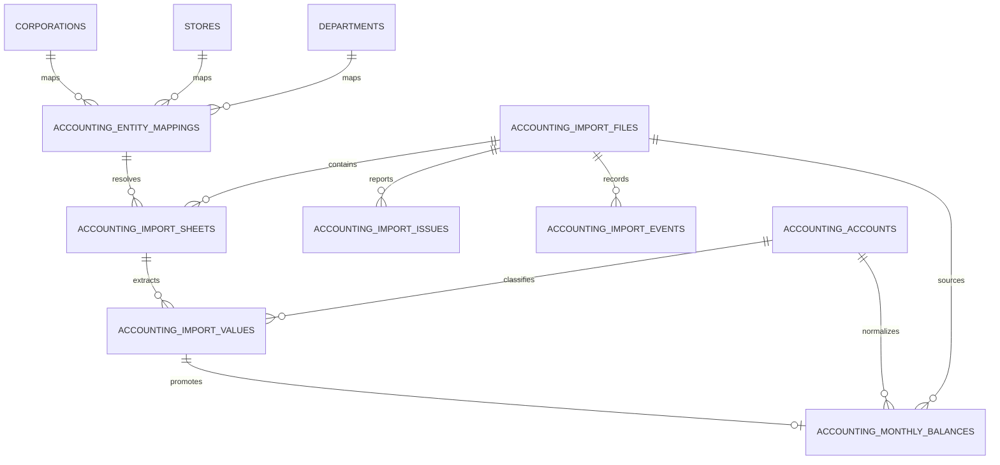
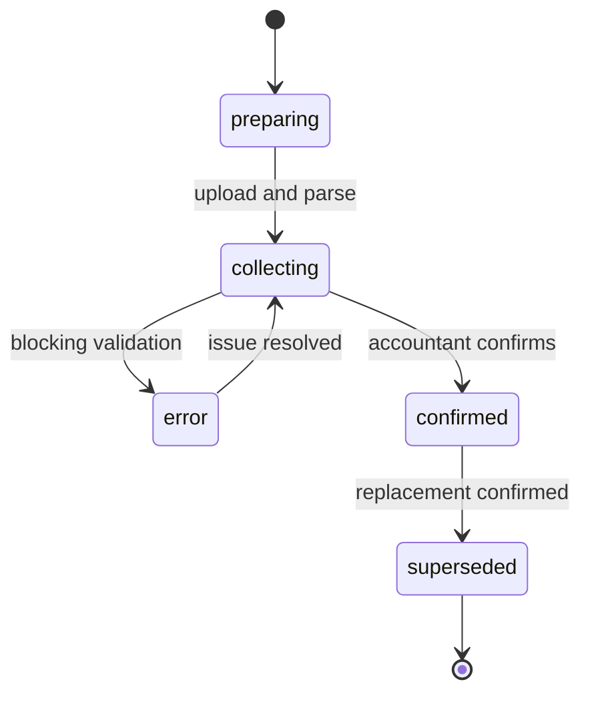

# Accounting Core設計案

## 1. 設計判定

Accounting Coreは実装可能である。ただし、本PhaseではDDL、migration、RLS、Storage、production importを実行しない。Phase 3は隔離環境でparser・mapping・reconciliationを作る **Conditional Go** とする。

設計原則:

- 原本、抽出raw、canonical balance、dashboard projectionを分離する。
- Coreの法人・店舗・部門を複製せず、UUID参照だけを保持する。
- source名の一致だけでIDを確定しない。
- importはimmutable。修正版は旧importをsupersedeし、物理削除しない。
- 未確認値をconfirmed viewへ出さない。
- source月次値をcanonicalとし、累計列はreconciliation証跡として保持する。

## 2. 既存資産の再利用方針

| 既存資産 | 確認結果 | 方針 |
|---|---|---|
| `public.corporations` | 法人物理正本候補、6件 | FK参照。Accounting側に法人名masterを作らない |
| `public.stores` | 店舗物理正本候補、22件 | FK参照。名称matchingはmapping候補作成まで |
| `public.departments` | 部門masterあり | FK参照。会計部門との一対一を前提にしない |
| `finance_source_documents` | read-only APIから存在を確認、DDL未確認 | Phase 3でschema比較。十分ならimport file ledgerとしてExtend、足りなければcompat viewを残して置換 |
| `finance_accounting_monthly_raw` | read-only APIが件数参照、DDL未確認 | raw staging再利用候補。列・一意制約・履歴性を確認するまで正本扱いしない |
| `finance_monthly_corporate_pl` | 法人月次read model | Accounting Coreからのprojection先候補。直接import先にしない |
| `finance_monthly_corporate_bs` | 法人月次read model | 同上 |
| `finance_monthly_department_pl` | 部門月次read model | 同上。store粒度を混在させない |
| `management_performance_snapshots` | 外部KPI aggregate | Accounting raw/canonicalには再利用しない。必要な確定指標だけsnapshot化 |
| `management_operation_logs` | Management操作log | Accounting監査の補助。金額確定・supersedeは専用append-only eventを推奨 |

既存finance tableのDDLはリポジトリに存在しないため、今回の設計でdrop/rename/replaceを確定しない。

## 3. 推奨ER

## 4. テーブル案

### 4.1 `accounting_import_files`

原本単位のimmutable ledger。

| column | type | rule |
|---|---|---|
| id | uuid | PK |
| source_system | text | `yayoi_excel` |
| fiscal_year | integer | 会計年度 |
| accounting_period_from/to | date | A5から抽出 |
| confirmed_through_month | date nullable | 経理が明示する確定対象月。ファイル名から推測しない |
| original_file_name | text | 表示用。PII/secretを含む名称は禁止 |
| storage_object_key | text | private bucket key。signed URLを保存しない |
| file_hash | text | SHA-256、source_systemとunique |
| parser_version | text | 再現可能なversion |
| import_status | text | preparing/collecting/confirmed/error/superseded |
| validation_status | text | pending/passed/failed/warning |
| uploaded_at/by | timestamptz/uuid | actorはserver sessionから解決 |
| confirmed_at/by | timestamptz/uuid nullable | 確定者 |
| replaced_import_id | uuid nullable | 修正版が置換する旧import |
| error_summary | jsonb | count/codeのみ。金額・原本断片を入れない |
| created_at/updated_at | timestamptz | metadata |

制約:

- `(source_system, file_hash)` unique。
- confirmedへの遷移はvalidation passedか、責任者のwarning override理由が必要。
- supersededは新importのconfirmedと同一transactionで設定する。
- 原本自体はprivate Storageでversioningまたはobject lock候補を使う。

### 4.2 `accounting_import_sheets`

| column | type | rule |
|---|---|---|
| id/import_file_id | uuid | file配下 |
| sheet_name | text | source名 |
| sheet_index | integer | 原本順 |
| statement_type | text | bs/pl |
| aggregation_type | text | company_total/hq_total/group_total/store_candidate/fc_candidate/department/shared |
| source_entity_name | text | source label |
| entity_mapping_id | uuid nullable | confirmed mapping |
| mapped_company_id/store_id/department_id | uuid nullable | snapshot FK。mappingと一致させる |
| mapping_status | text | unmapped/proposed/confirmed/rejected |
| source_period_from/to | date | sheet metadata |
| tax_basis | text | tax_exclusive/tax_inclusive/unknown |
| parser_version/layout_signature | text | drift検出 |
| created_at | timestamptz | immutable |

集計sheetと明細sheetを同一SUM対象にしない。`aggregation_type`とmapping hierarchyで二重計上を防ぐ。

### 4.3 `accounting_accounts`

| column | type | rule |
|---|---|---|
| id | uuid | PK |
| source_system | text | yayoi |
| source_statement_type | text | bs/pl |
| source_section_path | text | 例 `販売管理費` |
| source_account_code | text nullable | 今回はNULL |
| source_account_name | text | 正規化前 |
| source_occurrence_key | text nullable | 同名行を区別するcontext key |
| normalized_account_code/name | text | Accounting Core canonical |
| statement_type/account_category | text | 財務分類 |
| display_category | text nullable | dashboard mapping |
| sign_convention | text | debit_positive/credit_positive/as_exported |
| is_summary/is_sensitive/is_active | boolean | control |
| mapping_status | text | proposed/confirmed/rejected |
| sort_order | integer | source順とは分離 |

`source_system + statement + section + code/name + occurrence_key`を一意候補とする。名称だけのuniqueは禁止する。

### 4.4 `accounting_import_values`

原本cellに追跡可能なimmutable raw。既存`finance_accounting_monthly_raw`が要件を満たす場合は再利用する。

| column | type | rule |
|---|---|---|
| id/sheet_id | uuid | source sheet |
| source_row/source_column | integer | 原本位置 |
| source_period_label | text | 例 `6月度` |
| fiscal_month | date nullable | monthly列のみ |
| amount_type | text | pl_period_activity/pl_half_year_total/pl_cumulative_actual/bs_period_end_balance/closing_adjustment/closing_balance |
| source_account_label | text | 原本label |
| account_id | uuid nullable | mapping後 |
| amount | numeric nullable | blankはNULL、0は0 |
| value_state | text | amount/zero/blank/text/error |
| source_cell_hash | text | 値の監査用digest |
| created_at | timestamptz | immutable |

raw APIは通常consumerへ公開しない。

### 4.5 `accounting_monthly_balances`

確定表示のcanonical fact。

| column | type | rule |
|---|---|---|
| id | uuid | PK |
| fiscal_year/fiscal_month | integer/date | 月粒度 |
| company_id/store_id/department_id | uuid nullable | entity scope |
| account_id | uuid | canonical account |
| amount | numeric | source signをcanonical signへ変換済み |
| amount_type | text | P/Lは`period_activity`、B/Sは`period_end_balance`、必要時`closing_adjustment` |
| tax_basis/currency | text | tax_exclusive、JPY |
| source_import_file_id/source_sheet_id/source_value_id | uuid | lineage |
| data_status | text | collecting/confirmed/superseded |
| version_no | integer | entity-period version |
| confirmed_at/by | timestamptz/uuid | approval |
| created_at/updated_at | timestamptz | metadata |

予算・前年はこのtableへコピーしない。予算はversion付きbudget table、前年は過年度actualを同じqueryで取得する。P/Lの半期・当期累計はperiod activityから導出し、source累計列との差をcheck tableへ保存する。B/Sは月末時点残高であり、月次SUMを作らない。

unique候補:

`(company_id, store_id, department_id, fiscal_month, account_id, amount_type, version_no)`

NULLを含むentity keyはgenerated `entity_scope_key`またはexclusion constraintで一意性を保証する。

### 4.6 `accounting_entity_mappings`

| column | type | rule |
|---|---|---|
| id | uuid | PK |
| source_system/source_company_name | text | tenant boundary |
| source_entity_type/name/normalized_name | text | 原本entity |
| source_parent_name | text nullable | hierarchy |
| company_id/store_id/department_id | uuid nullable | exactly one primary target |
| aggregation_type | text | leaf/rollup/shared |
| effective_from/to | date | 改名・組織変更 |
| mapping_status | text | proposed/confirmed/rejected |
| confidence/match_method | text | exact/alias/manual |
| confirmed_at/by | timestamptz/uuid | 管理者承認 |

DB checkで、confirmed leaf mappingはcompany/store/departmentの許可された組合せを満たす。FC法人と店舗を名称から推定しない。

### 4.7 `accounting_import_issues`

severity、issue_code、file/sheet、row/column、masked source value、message、resolution_status、resolved_by/atを持つ。source valueは既定maskし、金額そのものはissue messageへ複製しない。

必須code候補:

- `PERIOD_DUPLICATE_COLUMN`
- `FUTURE_MONTH_ZERO`
- `UNKNOWN_ENTITY`
- `DUPLICATE_ENTITY_MAPPING`
- `UNKNOWN_ACCOUNT`
- `DUPLICATE_ACCOUNT_LABEL`
- `BS_OUT_OF_BALANCE`
- `PL_FORMULA_MISMATCH`
- `ROLLUP_MISMATCH`
- `TAX_BASIS_MISMATCH`
- `DUPLICATE_FILE`

### 4.8 `accounting_import_events`

file uploaded、parsed、validated、mapping changed、confirmed、returned、superseded、downloadedをappend-onlyで記録する。actor、role、scope、request_id、correlation_id、result、reason、before/after statusを持ち、会計金額・原本本文・secretを含めない。

## 5. 取込フロー

1. Backendがactor、role、scopeをsessionから解決する。
2. private upload URLを発行し、browserへservice roleを渡さない。
3. file hashで二重取込を拒否する。
4. sandbox workerがA1/A3/A5/A6/A8と月見出しを検証する。
5. sheet type、entity候補、layout signatureを抽出する。
6. account mappingをstatement/section/code/name/contextで解決する。
7. raw valueをimmutable保存する。blankと0を区別する。
8. B/S、P/L、累計、rollupを検証する。
9. unknown mappingとwarningを管理者review queueへ出す。
10. 経理確認後、canonical monthly balancesを同一versionでpromoteする。
11. confirmed viewを店舗営業管理、法人経営管理、役員dashboardへ提供する。

CSV対応時もstep 4のsource adapterだけを交換し、以降のcontractを共通化する。

## 6. 確定・修正版フロー

- collecting中は管理者previewのみ。
- confirmed後のrowを上書きしない。
- 修正版は新import、新version、新hashで取込み、比較差分を承認する。
- 新版confirmedと旧版supersededをatomic transactionにする。
- rollbackは旧versionを再度activeにする新eventで行い、履歴を消さない。
- 翌月15日前後の確定を想定し、`confirmed_through_month`を経理が明示する。

## 7. Read Adapter

consumerは物理tableを直接参照せず、次のversion付きcontractを使う。

- `getAccountingDataStatus(entity, period)`
- `getStoreMonthlyProfit(storeId, period, version)`
- `getCorporationMonthlyStatement(corporationId, period, statementType)`
- `getAccountBreakdown(entity, period, displayCategory)`
- `getImportLineage(metricId)`

既存`finance_monthly_*`はcompat projection候補であり、Accounting Coreのcanonical sourceにはしない。

## 8. Security / RLS

| principal | upload | validate/mapping | confirm/return | confirmed read | raw/original read |
|---|---:|---:|---:|---:|---:|
| accounting_operator | Allow | Allow | Allow（業務承認範囲） | 全法人 | Allow |
| accounting_manager | Allow | Allow | Allow | 全法人 | Allow |
| executive | Deny | Deny | Deny | 全法人 | Deny既定 |
| fc_owner | Deny | Deny | Deny | 許可法人・店舗のみ | Deny |
| store_manager | Deny | Deny | Deny | 自店舗の許可指標のみ | Deny |
| system_service | Backend actionのみ | Backend actionのみ | Deny | job scopeのみ | job scopeのみ |
| browser/service_role | service role使用禁止 | service role使用禁止 | service role使用禁止 | N/A | N/A |

実装条件:

- 全table RLS enabled + default deny。
- actor/company/storeをrequest bodyから信用しない。
- high-sensitivity readと全writeをauditする。
- original file bucketはprivate。短寿命signed URL、download event、法人scopeを要求する。
- mapping/confirmed/supersededはDB側でもaction/scope/stateを再検証する。
- SECURITY DEFINERを使う場合は固定search_path、最小GRANT、anonymous EXECUTE禁止。
- 金額のUPDATE/DELETEを許可せず、append/versionで訂正する。
- retention、backup、legal hold、削除責任者は経理責任者とSecurity ownerが決定する。

## 9. Phase 3受入条件

1. 7月重複列の業務理由と確定対象月入力方法を経理が承認。
2. 38 source entity mappingをCore UUIDへ管理者確認。
3. 人件費・家賃・材料費・EC按分のaccount ruleをversion化。
4. 代表3店舗×2か月のPDF golden reconciliation。
5. synthetic workbookでduplicate file、unknown entity/account、blank/zero、negative、layout driftをtest。
6. P/L source月次SUMと累計、B/S残高、P/L利益式、FC/教育rollupを100%検証。
7. private Storage、RLS、audit、supersede/rollbackをsandboxでnegative test。
8. 既存`finance_*` DDLを確認し、reuse/extend/compat viewをADRで確定。

## 10. 実装しない範囲

production DB投入、migration、RLS変更、dashboard反映、PDF生成、弥生API連携、完全自動確定、認証変更は本設計に含めない。

## 11. 第11〜13期の年度差異

Phase 3-2追加検証で、第11〜13期を同一adapterにより読み取り可能であることを
確認した。sheet/entity増加、P/L 86→87行、売上科目体系変更、和暦年度差を
検出した。年度を固定値で解釈せずA5集計期間から決定し、account/entity
mappingに年度有効期間を持たせる。

詳細、3期validation結果、差分一覧、第14期以降の互換性評価は
`docs/accounting/accounting-core-phase3-multiyear-comparison.md`を正本とする。
