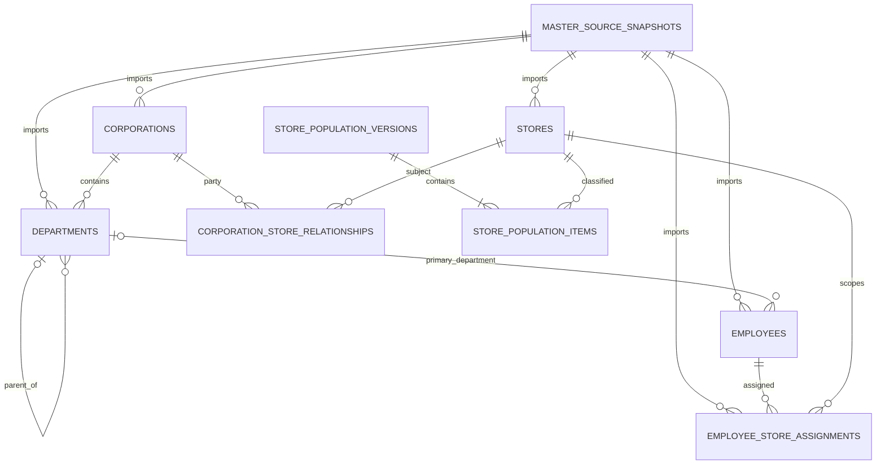

Exit code: 0
Wall time: 0.3 seconds
Output:
# PR001 — Core Master Migration Design Package

| Item | Decision |
|---|---|
| Project | Core Business Data Foundation |
| Phase | Phase 1 — Core Master Migration |
| Artifact | Migration Design Package only |
| Status | DESIGN READY FOR REVIEW / AUTHORING BLOCKED |
| Policy | Staging First、Production Masterが唯一の正本 |
| Database activity | なし |

## 0. Scope and frozen-boundary statement

本書はArchitecture v1.1、Business Definition Contract v1.1、Tax Policy Freeze、Implementation Roadmap、Migration Program v1、Staging First Development Policyを変更しない下位設計である。

今回の名称「PR001」はPhase 1設計審査のumbrellaを指す。実装時のmerge単位はMigration Program v1の分割を維持し、PR001=M001–M002、PR002=M003–M004、PR003=M005–M006、PR004=M007–M008、PR005=M009–M010とする。10 Migrationを1 PRへ再統合しない。

P0-Cが未完了であるため、`attested_id`は型aliasではなく**未解決設計パラメータ**である。Migration SQLでは使用できない。C01〜C10とS01〜S08の証跡後に、Productionの実型または承認済みStaging pseudonym型へ置換する。

## 1. Common table contract

### 1.1 History model

- 1 business entityはstable business IDを持つ。
- 変更ごとに新しいversion rowを追加する。activated rowを上書きしない。
- 有効期間は`[effective_from, effective_to)`。`effective_to IS NULL`はopen-ended。
- 同一stable IDの期間重複は禁止する。
- source snapshot、row digest、recorded timeから再現可能にする。
- sourceで削除された行を物理削除しない。canonical statusと`effective_to`で失効させる。
- `NULL`は不明・未提供・不適用、`0`は測定済みゼロ。相互変換しない。

### 1.2 Type rules

| Semantic | Design type | Rule |
|---|---|---|
| Version row ID | `uuid` | controlled importerが供給。生成方式は実装前に承認 |
| Production stable ID | `attested_id` | P0-Cで実型確定。employeeはpseudonymous tokenを許可 |
| Text/code | `text` | 不要な長さ制限なし。codeはformat check候補 |
| Effective date | `date` | business as-ofに使用 |
| Audit time | `timestamptz` | UTC保存、表示時にtimezone変換 |
| Ratio | `numeric(7,6)` | float禁止 |
| Digest | `text` | lowercase SHA-256 hexを想定。format check必須 |
| Status/classification | `text` + check/reference | Source値を直接保存せずcanonical mapping |

### 1.3 Referential-integrity decision

versioned parentへstable IDだけで通常FKを張ることはできない。親に複数versionが存在するためである。本設計では次を分離する。

1. `source_snapshot_id`などversion-independentな参照は物理FKにする。
2. corporation/store/department/employeeのstable-ID関係はlogical FKとしてdesign contractへ記載する。
3. P0-C後、既存Production stable-ID型とsnapshot semanticsを確認し、identity registry方式またはactivation-time validation方式をPhysical Canon ADRで選ぶ。
4. 選択前に、存在しない親IDを許容するMigration SQLを作らない。

全物理FK列に索引を付ける。logical FKも主要join/as-of用索引を持つ。

## 2. Table migration design

## 2.1 `core.corporations`

**目的:** 法人のStaging canonical historyを、Production snapshotから非PII属性だけ保持する。
**責務:** 法人identity、code、表示属性、status、有効期間、source lineage。税務・口座・連絡先は責務外。

| Column | Type | NULL | Default | Key / rule |
|---|---|---:|---|---|
| `corporation_version_id` | `uuid` | No | none | PK。controlled importで供給 |
| `corporation_id` | `attested_id` | No | none | stable Production IDまたはapproved mapping |
| `corporation_code` | `text` | No | none | canonical business code |
| `legal_name` | `text` | Yes | none | business-publicかowner承認時だけ複製 |
| `display_name` | `text` | No | none | approved display label |
| `status` | `text` | No | none | canonical allow-list |
| `effective_from` | `date` | No | none | inclusive |
| `effective_to` | `date` | Yes | none | exclusive/open-ended |
| `source_snapshot_id` | `uuid` | No | none | physical FK→`governance.master_source_snapshots` |
| `source_record_digest` | `text` | No | none | masked canonical row digest |
| `recorded_at` | `timestamptz` | No | transaction time | ingestion audit time |

**PK:** `corporation_version_id`。
**FK:** snapshotは物理FK。corporation stable IDはidentity/activation contract。
**Unique:** `(corporation_id,effective_from)`、`(corporation_code,effective_from)`。
**Index:** `(corporation_id,effective_from desc)`、`(status,effective_from,effective_to)`、`source_snapshot_id`。
**Check:** `effective_to > effective_from`、digest format、status allow-list、blank code/name禁止。
**有効期間:** stable ID単位のoverlap 0。codeの再利用はowner承認なしに許可しない。
**論理削除:** `status='inactive'`等 + `effective_to`。`deleted_at`とphysical deleteは使用しない。
**監査:** snapshot、digest、recorded time。activated versionの変更はmaster audit ledgerへappend。

## 2.2 `core.stores`

**目的:** 店舗identityとlifecycleをStagingで再現し、後続のofficial populationおよびscopeの基礎とする。
**責務:** 店舗code/表示名/status/open-close/effective history。直営/FCと法人関係はrelationship table、official 20はpopulation ledgerの責務。

| Column | Type | NULL | Default | Key / rule |
|---|---|---:|---|---|
| `store_version_id` | `uuid` | No | none | PK |
| `store_id` | `attested_id` | No | none | stable Production ID |
| `store_code` | `text` | No | none | canonical business code |
| `display_name` | `text` | No | none | business-publicまたはStaging substitute |
| `status` | `text` | No | none | active/inactive/closed/future/unknown mapping |
| `opened_on` | `date` | Yes | none | Attestされた場合だけ |
| `closed_on` | `date` | Yes | none | Attestされた場合だけ |
| `business_timezone` | `text` | No | `Asia/Tokyo` | IANA timezone |
| `effective_from` | `date` | No | none | inclusive |
| `effective_to` | `date` | Yes | none | exclusive |
| `source_snapshot_id` | `uuid` | No | none | physical FK |
| `source_record_digest` | `text` | No | none | canonical digest |
| `recorded_at` | `timestamptz` | No | transaction time | audit time |

**PK:** `store_version_id`。
**FK:** snapshot physical。corporationを直接持たずrelationship tableへ分離。
**Unique:** `(store_id,effective_from)`、`(store_code,effective_from)`。
**Index:** `(store_id,effective_from desc)`、`(status,effective_from,effective_to)`、`source_snapshot_id`、current-row partial index候補。
**Check:** interval order、`closed_on >= opened_on`、timezone allow-list/validation、blank code/name禁止。
**有効期間:** store ID単位のoverlap 0。opened/closed dateとeffective intervalの矛盾はactivation error。
**論理削除:** closed/inactive versionを追加。21件目を削除して20件に見せない。
**監査:** source lineageとclassification decisionは分離して記録。

## 2.3 `core.departments`

**目的:** 法人配下の組織階層をas-ofで解決する。
**責務:** department identity、code、表示名、corporation/parent relation、status/history。Store scopeを暗黙に付与しない。

| Column | Type | NULL | Default | Key / rule |
|---|---|---:|---|---|
| `department_version_id` | `uuid` | No | none | PK |
| `department_id` | `attested_id` | No | none | stable ID |
| `department_code` | `text` | No | none | canonical code |
| `display_name` | `text` | No | none | approved label/substitute |
| `corporation_id` | `attested_id` | No | none | logical FK→corporation identity |
| `parent_department_id` | `attested_id` | Yes | none | logical self-FK |
| `status` | `text` | No | none | canonical allow-list |
| `effective_from` | `date` | No | none | inclusive |
| `effective_to` | `date` | Yes | none | exclusive |
| `source_snapshot_id` | `uuid` | No | none | physical FK |
| `source_record_digest` | `text` | No | none | canonical digest |
| `recorded_at` | `timestamptz` | No | transaction time | audit time |

**PK:** `department_version_id`。
**FK:** snapshot physical。corporation/parentはP0-C後のPhysical Canon ADRで物理化方式確定。
**Unique:** `(department_id,effective_from)`、`(corporation_id,department_code,effective_from)`。
**Index:** `(department_id,effective_from desc)`、`corporation_id`、`parent_department_id`、`(status,effective_from,effective_to)`。
**Check:** interval order、`department_id <> parent_department_id`、blank code/name禁止。
**有効期間:** department単位overlap 0。parent relationは同じas-ofで有効なdepartmentを要求。
**論理削除:** inactive/effective end。子が有効なまま親を失効させるsnapshotはreject。
**監査:** hierarchy change、cycle rejection、mapping resultをaudit eventへ記録。

## 2.4 `core.employees`

**目的:** identity/role/scope解決に必要な最小employee identityだけをStagingへ保持する。
**責務:** pseudonymous employee ID、synthetic alias、minimal status、primary department history。PII、人事・給与情報、auth identityは責務外。

| Column | Type | NULL | Default | Key / rule |
|---|---|---:|---|---|
| `employee_version_id` | `uuid` | No | none | PK |
| `employee_id` | `attested_id` or approved token `text` | No | none | stable pseudonymous identity |
| `display_alias` | `text` | No | none | deterministic Staging synthetic alias |
| `status` | `text` | No | none | active/leave/inactive/retired/unknown mapping |
| `primary_department_id` | `attested_id` | Yes | none | logical FK。Sourceで確認できる場合のみ |
| `effective_from` | `date` | No | none | inclusive |
| `effective_to` | `date` | Yes | none | exclusive |
| `source_snapshot_id` | `uuid` | No | none | physical FK |
| `source_record_digest` | `text` | No | none | PIIをdigest inputに含めない |
| `recorded_at` | `timestamptz` | No | transaction time | audit time |

**明示的に存在させない列:** 実名、実メール、Firebase UID、電話、住所、生年月日、口座、給与、税・保険、家族、通勤、文書、写真、free text。
**PK:** `employee_version_id`。
**FK:** snapshot physical。department relationはPhysical Canon ADRで確定。auth identity FKは持たない。
**Unique:** `(employee_id,effective_from)`。aliasは表示用でidentity/Unique根拠にしない。
**Index:** `(employee_id,effective_from desc)`、`primary_department_id`、`(status,effective_from,effective_to)`、`source_snapshot_id`。
**Check:** interval order、alias blank禁止、status allow-list。PII deny-listはschema testで検査。
**有効期間:** employee単位overlap 0。
**論理削除:** retired/inactive/effective end。identity tokenを再利用しない。
**監査:** raw employee IDをaudit metadataへ出さず、run-scoped/approved digestだけを利用。

## 2.5 `core.employee_store_assignments`

**目的:** Store scopeの唯一の正本となるeffective-dated employee-store relationを保持する。
**責務:** employee、store、role、assignment kind、allocation、status、有効期間。global/corporation scopeは別のapproved role-scope relationの責務。

| Column | Type | NULL | Default | Key / rule |
|---|---|---:|---|---|
| `assignment_version_id` | `uuid` | No | none | PK |
| `assignment_id` | `attested_id` or deterministic token | No | none | stable assignment identity |
| `employee_id` | employee approved token type | No | none | logical FK→employee identity |
| `store_id` | `attested_id` | No | none | logical FK→store identity |
| `assignment_role_code` | `text` | No | none | approved role dictionary |
| `assignment_kind` | `text` | No | none | primary/secondary/temporary/support |
| `allocation_ratio` | `numeric(7,6)` | Yes | none | unknown=NULL、0禁止、0<value<=1 |
| `effective_from` | `date` | No | none | inclusive |
| `effective_to` | `date` | Yes | none | exclusive |
| `status` | `text` | No | none | pending/active/inactive mapping |
| `source_snapshot_id` | `uuid` | No | none | physical FK |
| `source_record_digest` | `text` | No | none | canonical digest |
| `recorded_at` | `timestamptz` | No | transaction time | audit time |

**PK:** `assignment_version_id`。
**FK:** snapshot physical。employee/store stable-ID relationはPhysical Canon ADRで物理化方式を確定。
**Unique:** `(assignment_id,effective_from)`。同一employeeのprimary assignmentは期間重複不可。
**Index:** `(employee_id,effective_from,effective_to)`、`(store_id,effective_from,effective_to)`、`(store_id,assignment_role_code)`、`source_snapshot_id`。
**Check:** interval order、allocation range、role/kind/status allow-list、employee/store自己矛盾なし。
**有効期間:** assignment ID単位overlap 0。primary overlap 0。secondary/supportは複数可。
**論理削除:** inactive/effective end。scope喪失をrow deleteで表現しない。
**監査:** scope追加・失効・role mapping・rejectionをappend-only auditへ記録。

## 3. Supporting objects required by the five masters

| Object | Purpose | Migration |
|---|---|---|
| `governance.master_source_snapshots` | snapshot/run/masking/digest/status | M002 |
| `core.corporation_store_relationships` | direct/FCおよびowner/operator/sales/accounting relation | M006 |
| `governance.store_population_versions` | official population version/approval | M006 |
| `governance.store_population_items` | 20/13/7と21件目の明示分類 | M006 |
| `governance.master_versions` | activated canonical set | M007 |
| `governance.master_audit_events` | append-only governance audit | M007 |

supporting objectはProduction Masterを置換しない。Staging snapshotのmapping、validation、publicationだけを管理する。

## 4. Relationship design

### 4.1 Cardinality

| Parent | Child | Cardinality | As-of rule |
|---|---|---|---|
| source snapshot | each master version | 1:N | every imported row has exactly one snapshot |
| corporation | department | 1:N | child corporation must be active at child as-of |
| department | child department | 0..1:N | rootはparent NULL、cycle禁止 |
| department | employee primary department | 0..1:N | source-confirmed relationのみ |
| employee | assignment | 1:N | active assignment requires valid employee |
| store | assignment | 1:N | active assignment requires valid operating store |
| corporation/store | relationship | 1:N | relation typeごとにperiod overlap 0 |
| population version | population item | 1:N | published v1はofficial 20/direct 13/FC 7/unresolved 0 |

### 4.2 Dependency order

`snapshot → corporation/store → department/employee → assignment → corporation-store relation/population → master version/audit → projections → RLS/Grant → verification`

## 5. Migration units M001–M010

| Migration | One-migration boundary | Included | Excluded / dependency |
|---|---|---|---|
| M001 | Namespace/security boundary | schemas、ownership contract、default-deny default privileges | table/role login作成は別承認 |
| M002 | Source envelope | snapshot table、reference dictionaries/check domains | five masters |
| M003 | Independent business roots | corporations、stores、their constraints/indexes | relationships/population |
| M004 | Organization/person minimal history | departments、employees、constraints/indexes | assignments、auth identity |
| M005 | Store-scope canon | employee_store_assignments、effective constraints/indexes | global/corporation role scope |
| M006 | Operating model/population | corporation-store relationships、population version/items | projections |
| M007 | Governance ledger | master versions、audit events、immutability contract | consumer read model |
| M008 | Projection contract objects | private/security-invoker master projections | API implementation/routingは禁止 |
| M009 | Authorization boundary | RLS、FORCE RLS decision、explicit grants/revokes | data migration |
| M010 | Verification assets | synthetic fixtures、contract/negative tests | Production data/IDs/PII |

Migrationごとにforward replay、object inventory、owner/Grant diff、down/forward-fix decisionを持つ。M003とM004の並列authoringは可能だが、統合順はM001→M010を変えない。

## 6. PR001 rollback design

### 6.1 Rollback layers

| State | Rollback |
|---|---|
| Design only（現在） | 文書reviewをreject/revise。DB rollbackなし |
| Fresh local、dataなし | M010→M001を逆順replayし、fresh DB再作成で検証 |
| Staging candidate、未公開 | consumer Grant revoke→projection停止→candidate version withdraw。必要時だけobjectsを逆順drop |
| Staging activated、consumer接続済み | app/master version pointerを直前versionへ戻す。history/snapshot/auditを保持 |
| Published/Production | 本Phaseでは到達禁止。将来もFact/Master historyを削除せずforward-fix/new version |

### 6.2 Independence requirements

- BDF専用schema以外をdrop/alterしない。
- Production objectへのFK、trigger、view dependencyを作らない。
- Staging→Production network/write pathを持たない。
- Consumerがdirect table名をcontractにしないため、Grant revokeとversion pointerで隔離できる。
- M001 rollback時もplatform標準roleをdrop/alterしない。
- snapshot raw exportはDB外restricted transform zoneで期限管理し、DB rollbackとは別に破棄receiptを残す。

Rollback rehearsalがM010で成功しない限りStaging apply Gateへ進めない。

## 7. Release Gate

### Gate PR001-D — Design complete

- frozen文書との差分0、または明示された下位具体化だけ。
- 5 tableすべてにcolumn/type/null/default/key/index/check/effective/delete/audit contractがある。
- logical FKとphysical FKを偽って混同していない。
- PII deny-list、Snapshot/Mapping/Masking-onlyが明記されている。
- M001〜M010の境界、依存、rollback、testがreview可能。

### Gate PR001-A — Migration authoring start

次をすべて要求する。

1. P0-C PASS。
2. C01〜C10 COMPLETE receipt。
3. S01〜S08別run COMPLETE receipt。
4. 5 Production Masterの実型、列、PK/FK/Unique/Index/RLS/Grant確定。
5. assignmentのstable ID、role、status、有効期間semantics確定。
6. official=20、direct=13、FC=7、unresolved=0、21件目分類の署名済み証明。
7. actual-column mapping/masking addendum承認。
8. Physical Canon ADRでstable-ID referential integrity方式を確定。
9. Staging Data API exposure/role baselineをread-only確認。

### Gate PR001-S — Staging release

本タスクでは到達しない。別承認、全Migration review、fresh replay、advisor/static checks、synthetic test、RLS negative test、rollback rehearsal、Security/Data owner署名が必要。

## 8. Acceptance criteria and review checklist

### Data model

- stable IDとversion row IDが分離されている。
- half-open intervalとoverlap prohibitionが全history tableで一貫する。
- logical deletionにphysical deleteを使わない。
- activated historyはimmutableである。
- FK列・logical relation join列に索引が設計されている。
- 20/13/7をstore rowの削除やname推測で作っていない。

### Privacy and Staging First

- employeesに禁止PII列がない。
- source record digestにraw PIIを含めない。
- `SELECT *`/automatic schema copyを前提にしない。
- Production→Staging one-way snapshotだけで、dual-write/CDC write-backがない。
- Production IDsの外部公開を前提にしない。

### Security

- private tablesはdefault deny、RLS defense-in-depth。
- `anon`と`authenticated`にCore table direct Grantなし。
- `TO authenticated`だけのpolicyを許可しない。
- RLS predicate用employee/store relationに索引がある。
- Viewは`security_invoker`検証対象。公開`SECURITY DEFINER`禁止。
- app/service roleをobject ownerにしない。

### Testability

- Production ID/PIIなしのsynthetic fixtureで全constraintを検証できる。
- orphan、overlap、cycle、invalid status、cross-store、unpublishedをnegative testできる。
- snapshot再取込がidempotentである。
- rollback後もaudit/historyが失われない。

## 9. Store Operations start conditions

| Capability | Start condition |
|---|---|
| Contract/mock development | Design Gate PR001-D PASS後。synthetic ID/dataのみ |
| Master-only integration | Migration Program PR005 / Phase 1 G1 PASS後 |
| Store selector/role routing | published master + population version、assignment scope、RLS negative tests PASS |
| Business KPI integration | Phase 3 G3 PASS後 |

Store OperationsはCore tableを直接読まず、Phase 1完了後のread-only Projection contractだけを利用する。PR001単体、M001〜M002単体、unpublished populationでは利用開始不可。

## 10. Finance dependency

Phase 1はAccounting Factに依存しない。依存方向はFinance→Core Masterである。

| Finance use | Phase 1 dependency |
|---|---|
| import dimension validation | corporation/store stable identity + as-of relation |
| direct/FC reconciliation | published population/operating model |
| historical period resolution | effective-dated corporation/store relation |
| Finance implementation start | Phase 2 G2（lifecycle）/ Phase 5 G5（statements） |

FinanceはPhase 1 tableへwriteせず、独自corporation/store masterを持たない。P/L・B/S・CF、金額、Budget/Forecastは本Packageの対象外。

## 11. Production difference and Staging synchronization

| Concern | Production Master | Staging BDF |
|---|---|---|
| Authority | 唯一のCore Master正本 | authoritativeではないvalidated snapshot/read model |
| Shape | C01〜C10でAttestする実構造 | canonical minimal schema |
| ID | 実ID型 |同型保持またはapproved pseudonymous/token mapping |
| Employee data | 業務上必要な実属性を含み得る | minimal identity/status/synthetic aliasのみ |
| History | 実構造をAttestして判断 | immutable effective-dated versions |
| Direct/FC/population | S01〜S08で証明 | signed population versionとして保持 |
| Writes | existing Production ownership | Stagingからのwrite-back 0 |
| Sync | source snapshotを発行 | allow-listed extract→pre-DB mask→validate→activate |

### Sync lifecycle

1. approved Production snapshot/run receiptを固定。
2. explicit column allow-listでextractする。`SELECT *`は禁止。
3. restricted transform zoneでexclude/mask/pseudonymize/substituteする。
4. content/row digestとmapping policy versionを生成する。
5. Stagingへcandidate snapshotとして投入する。
6. counts、relations、interval、PII absence、20/13/7を検証する。
7. steward approval後に新master versionをactivateする。
8. consumer pointerをatomic switchする。
9. 旧versionをsupersededにするが削除しない。

同期方式の頻度は本Packageで固定しない。Phase 0の実構造・運用SLA後に承認する。CDC、Production trigger、Production schema changeは採用しない。

## 12. Blockers

| ID | Blocker | Blocks |
|---|---|---|
| B1 | P0-A authorization receipt未完了 | C01〜C10実行 |
| B2 | C01〜C10未実行 | 実列/型/key/security差分 |
| B3 | S01〜S08未compile/未承認/未実行 | 21件目、20/13/7 population |
| B4 | ID型とstable-ID FK方式未確定 | M003〜M006 authoring |
| B5 | assignment実構造/有効期間semantics未確定 | M005 authoring |
| B6 | actual-column masking/mapping addendum未署名 | Staging load design finalization |
| B7 | Production RLS/Grant baseline未確定 | M009 compatibility review |
| B8 | identity→employee→role→scope署名未完了 | assignment RLS predicate |

## 13. Final design audit corrections

### 13.1 Immutable version row and effective dating

両者は責務を重複しない。

| Mechanism | Responsibility |
|---|---|
| immutable version row | 「何がsourceから取り込まれ、承認されたか」を改変不能なrowとして保存する |
| effective dating | そのversion rowがbusiness time上で有効な期間を表す |
| master version | 同時にConsumerへ提供する複数entity versionの集合を固定する |
| source snapshot | Productionから取得・maskした入力集合とlineageを固定する |

訂正は既存rowのUPDATEではなく、新version rowを追加する。誤ったrowはbusiness validityを新しい訂正versionで置換し、元rowと訂正理由をaudit ledgerに残す。

### 13.2 Unique current-row resolution

`current`は次の1方式だけで解決する。

1. Consumer releaseが指す1つのpublished `master_version_id`を固定する。
2. requestの`as_of`について`effective_from <= as_of`かつ`effective_to IS NULL OR as_of < effective_to`を満たすrowを選ぶ。
3. 同一stable IDで該当rowがexactly oneであることを要求する。
4. 0件はnot-current、2件以上はintegrity failureとしてProjection publicationを停止する。

`max(recorded_at)`、最大version ID、`status='active'`だけ、`effective_to IS NULL`だけでcurrentを推測してはならない。

### 13.3 Period-overlap enforcement contract

同一stable IDの有効期間をdate rangeとして扱い、exclusion constraintまたは同等のtransaction-safe constraintでoverlapを禁止する。単純な事前SELECTだけではrace conditionを防げないためAcceptance対象外とする。open-ended periodも同じconstraintへ含める。

employee assignmentでは追加で次を要求する。

- 同一`assignment_id`のoverlap 0。
- 同一employeeの`assignment_kind='primary'`かつactiveな期間のoverlap 0。
- secondary/temporary/supportは複数許可するが、同一employee/store/role/kindの重複期間は0。

### 13.4 Status and effective-period consistency

| Status category | `effective_to` | Meaning |
|---|---|---|
| active/current candidate | NULLまたは未来日 | as-of条件を満たす場合だけcurrent |
| future/pending | future startを持つ | start前はcurrentではない |
| inactive/closed/retired | 過去または当日のexclusive end必須 | end以後はcurrentではない |
| unknown/unresolved | sourceどおり、publication不可 | 0やactiveへ変換しない |

statusはbusiness state、effective intervalはbusiness timeであり、一方から他方を暗黙生成しない。矛盾する組合せはcandidate validationでrejectする。physical deleteは全5 Master、snapshot、population、version、auditで禁止する。

### 13.5 Snapshot idempotency and manual-edit prohibition

`governance.master_source_snapshots`は次のidempotency contractを持つ。

- canonical source version = `source_system + source_as_of + content_digest + masking_policy_version + mapping_policy_version`。
- 同一canonical source versionはUniqueで二重登録を拒否する。
- Productionがstable `source_version_ref`を提供する場合は保存し、同一source system内でUniqueにする。未提供時はcontent digest contractを使う。
- retryは既存snapshot IDを返すかsafe stopし、新candidateを作らない。
- 同じsourceでもmasking/mapping policy変更時は別snapshotとし、parent snapshotをlineageで参照する。

Staging canonical rowの手修正は禁止する。mapping訂正は承認済みmapping policyの新version、source訂正は新snapshotとして再取込する。StagingからProductionへのcredential、network route、job、trigger、API、write commandを持たせない。

### 13.6 Store-scope sufficiency decision

`employee_store_assignments`は店舗単位scopeの唯一の正本として、次を表現できる。

| Requirement | Representation |
|---|---|
| 主所属 | `assignment_kind='primary'` |
| 兼務 | secondary/supportの並行row |
| 一時応援 | temporary + bounded effective interval |
| 異動 | 旧assignmentをexclusive end、新assignmentを同日start |
| role | `assignment_role_code` |
| 有効期間 | `effective_from/effective_to` |
| store scope | as-ofで有効なemployee/store assignment集合 |

不足する可能性があるのは、Productionにstable assignment ID、role、kind/status、有効期間が存在するかである。これらが存在しない場合はM005 authoringを停止し、approved deterministic ID、mapping、またはseparate effective role relationをPhysical Canon ADRで決定する。corporation/global scopeはassignmentから推測せず、PR001対象外の明示role-scope relationを要求する。

## 14. Store Operations G1 connection fields

| Required field | Canonical source | Projection/API field | Current decision |
|---|---|---|---|
| `store_id` | `core.stores.store_id` | `store_id` | defined; physical type BLOCKING |
| `store_code` | `core.stores.store_code` | `store_code` | defined; Production mapping required |
| `store_name` | `core.stores.display_name` | `store_name` | explicit API alias; approved public/substitute only |
| `corporation_id` | active corporation-store relationship | `corporation_id` | relationship type must be selected; BLOCKING |
| `store_type` | population classification + operating model | `store_type` | direct/FC/HQ/virtual/etc mapping; BLOCKING |
| active status | `core.stores.status` + as-of interval | `is_active`, `status` | mapping semantics BLOCKING |
| employee assignment | assignment stable identity | `assignment_id` | defined; physical source BLOCKING |
| role | `assignment_role_code` | `role` | dictionary mapping BLOCKING |
| `valid_from` | `effective_from` | `valid_from` | explicit alias |
| `valid_to` | `effective_to` | `valid_to` | explicit alias; NULL=open-ended |
| primary assignment | `assignment_kind='primary'` | `is_primary` | deterministic derived boolean |
| store scope | current published assignments | `store_scope` | auth→employee resolution + as-of assignments |

G1 Projectionはこれらを同じpublished master/population versionと`as_of`から返す。`store_name`や`store_type`を新しい正本列として重複保存しない。上表のBLOCKING項目がP0-C/Physical Canon ADRで解決されるまでStore Operations実接続は禁止する。

## 15. RLS, Grant, negative-test and View audit

| Object | RLS/Grant design | Mandatory negative tests |
|---|---|---|
| corporations | private、sync/steward/builder/auditorのみ。Consumer direct SELECTなし | anon、authenticated direct、unpublished、out-of-corporation |
| stores | private、ConsumerはAPI Projectionのみ | cross-store、inactive-as-current、21st/unpublished leakage |
| departments | private、department relationでscope拡張しない | forged department、cycle/orphan、cross-corporation |
| employees |最小属性でもprivate、raw directory APIなし | PII column/value、other employee、inactive identity |
| assignments | private、scope-resolving Projectionのみ | forged employee ID、expired assignment、cross-store、role escalation |
| governance | app Grantなし、auditor/controlled writerだけ | draft/unapproved snapshot/version/population |
| `api.*` views | explicit SELECT、caller scope predicate必須 | anon、no employee link、multiple employee link、unpublished version |

すべてのexposed ViewはPostgres version確認後に`security_invoker`を検証する。利用不能なversionではViewをprivate schemaへ置き、`anon`/`authenticated`からrevokeする。公開schemaの`SECURITY DEFINER`、`TO authenticated`だけのpolicy、`user_metadata`を使うauthorizationは禁止する。

## 16. Unresolved parameter audit

| Unresolved parameter | Classification | Affected design / required resolution |
|---|---|---|
| 5 Masterのstable ID実型 | BLOCKING | 全PK/logical FK/API型。C02/C03 + Physical Canon ADR |
| Productionの実在column名・型・NULL | PRODUCTION MAPPING REQUIRED | canonical column mapping addendum。C02 |
| Production PK/FK/Unique | BLOCKING | identity integrity、relation reuse判断。C03 |
| Production Index | NON-BLOCKING | Production変更はしない。sync query/reconciliation設計の参考。C04 |
| Production RLS/Policy/Grant | PRODUCTION MAPPING REQUIRED | compatibility/security baseline。C05/C06 |
| corporation status列/semantics | PRODUCTION MAPPING REQUIRED | canonical status/effective mapping。C08 |
| store status/open/close列 | BLOCKING | active status、21st、official population。C08/S pack |
| department status/parent/corporation列 | PRODUCTION MAPPING REQUIRED | hierarchy/as-of mapping |
| employee status/department列 | PRODUCTION MAPPING REQUIRED | active employeeとminimal scope mapping |
| assignment stable ID | BLOCKING | idempotency/history。存在しなければapproved deterministic token |
| assignment employee/store FK | BLOCKING | Store Scope正本成立条件 |
| assignment role/kind/primary列 | BLOCKING | role、主所属、兼務、scope action |
| assignment status/effective-from/to列 | BLOCKING | 異動・失効・as-of scope |
| assignment allocation ratio | NON-BLOCKING | authorizationに使わない。存在する場合だけmapping |
| direct/FC operating-model列 | BLOCKING | `store_type`と13/7証明。S02/S06 |
| corporation-store relation列/期間 | BLOCKING | Finance/Store Operations corporation ID。S03 |
| HQ/virtual/legacy/test判定列 | BLOCKING | 21件目とofficial 20除外理由。S01/S02/S05/S07 |
| duplicate判定用non-PII key | BLOCKING | official distinct store count。S04 |
| official population rule/version/as_of | STAGING-ONLY DESIGN PARAMETER | S01〜S08証跡をpopulation versionへ固定 |
| snapshot UUID生成方式 | STAGING-ONLY DESIGN PARAMETER | implementation reviewでtime-ordered/deterministic choice |
| mapping/masking policy version ID | STAGING-ONLY DESIGN PARAMETER | governance ownerが発行 |
| store timezone default | STAGING-ONLY DESIGN PARAMETER | v1=`Asia/Tokyo`; source差異はvalidation |
| Production実名/email/Firebase UID等PII | EXCLUDE FROM PR001 | Stagingに取得・保持しない |
| corporation/global role scope | EXCLUDE FROM PR001 | separate explicit role-scope contract |
| Accounting/Business Fact columns | EXCLUDE FROM PR001 | later phases only |

BLOCKINGはMigration SQL authoringまたはG1 publicationを停止する。NON-BLOCKINGはProduction変更を要求せず、実装前review noteとして残す。

## 17. Migration-boundary final audit

| Migration | Creation responsibility | Dependency | Rollback | Validation / release gate | Failure stop |
|---|---|---|---|---|---|
| M001 | schema、ownership、default deny | P0-C、platform role baseline | usage/grant revoke; emptyならschema reverse | owner/default privilege inventory | public exposure、owner mismatch |
| M002 | source snapshot、reference contract | M001 | candidate snapshot withdraw; empty object reverse | idempotency、digest、status checks | duplicate source version、invalid policy/run |
| M003 | corporations、stores | M002 | unpublished versions withdraw; empty object reverse | interval、ID/code、PII、index checks | unresolved type、overlap、orphan snapshot |
| M004 | departments、employees | M002、M003 corporation identity | same as M003 | hierarchy、cycle、PII deny-list、interval | unresolved FK方式、cycle、PII detection |
| M005 | assignments | M003 stores、M004 employees | candidate withdraw; published history保持 | primary/duplicate overlap、role/status/as-of | missing stable ID/FK/effective semantics |
| M006 | corporation-store relation、population | M003、M002、S01〜S08 proof | unpublished population withdraw/pointer restore | 20/13/7/0、21st reason、relation coverage | invariant false、unresolved classification |
| M007 | master version、audit ledger | M003〜M006 | active pointer restore; ledger保持 | immutability、transition、audit coverage | partial version、audit gap |
| M008 | private/API Projection definitions | M007 | prior View definition/pointer restore | exact-one current、schema contract、PII absence | multiple current、version mixing |
| M009 | RLS、Grant | M001、M003〜M008、identity-scope contract | Grant revoke/API isolation。RLS disable禁止 | role matrix、security-invoker、negative tests | any cross-scope/unpublished access |
| M010 | synthetic fixtures、verification manifest | M001〜M009 | fixture/schema test cleanup only | fresh replay、rollback rehearsal、all tests | any failed test、Production ID/PII detection |

各Migrationは単一責務であり、依存は前方向だけである。M004がM003のcorporation identityを参照し、M005がM003/M004を参照する形に固定したため循環依存はない。M009はpolicy predicate対象object完成後、M010は全object完成後にのみ実行する。

## 18. Completion audit

| Check | Result |
|---|---|
| 20 design concerns covered | PASS |
| unresolved parameter list/classification | PASS |
| immutable/effective dating separation | PASS |
| exactly-one current resolution | PASS |
| overlap-prevention contract | PASS |
| status/effective consistency | PASS |
| physical delete prohibition | PASS |
| snapshot duplicate prevention | PASS |
| Production canon/write-back prohibition | PASS |
| Store Scope expression | CONDITIONAL PASS — Production assignment fields BLOCKING |
| Store Operations required field mapping | CONDITIONAL PASS — P0-C mappings BLOCKING |
| rollback design | PASS |
| M001–M010 cycle | PASS — none |

## 19. Review verdict

| Decision | Status |
|---|---|
| Migration Design Package | **CONDITIONAL PASS** — standalone logical design成立、Production mapping blockersあり |
| Frozen architecture change | NONE |
| Migration SQL authoring | **BLOCKED** — P0-C/Physical Canon ADR未完了 |
| PR001 implementation merge | **NOT AUTHORIZED** |
| Staging apply | **PROHIBITED** |
| Production connection/change | **PROHIBITED** |
| Store Operations Master connection | **BLOCKED** — Phase 1 G1未完了 |
| Finance Master connection | **BLOCKED** — Phase 1 G1未完了 |

推奨レビュー順は、Core DB Architect→Data Owner→Security Owner→Store Operations Owner→Finance Owner。全員がDesign Gate PR001-Dへ署名しても、P0-C未完了の間はMigration authoringを開始しない。
