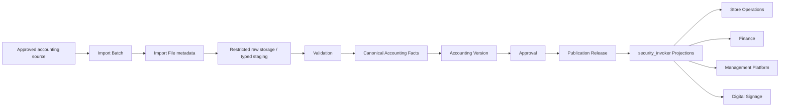
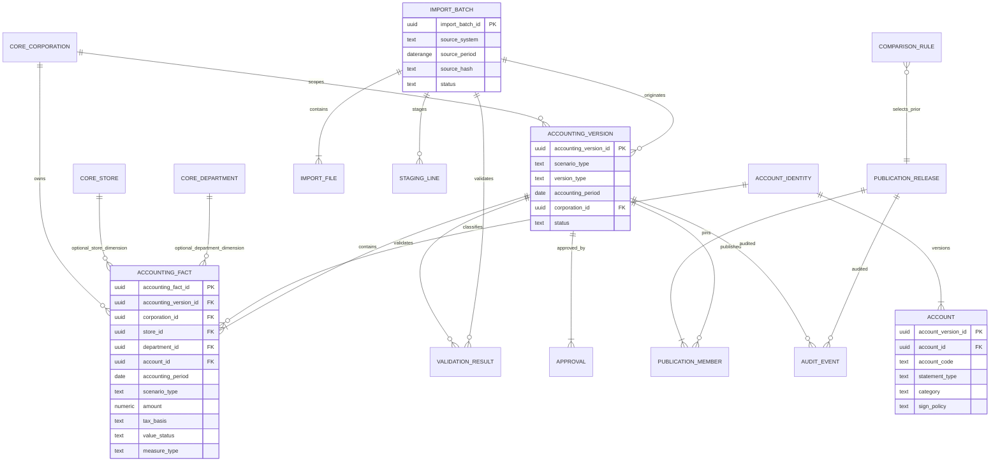

# Core Business Data Foundation — PR002 Accounting Foundation Design Package

| Item | Contract |
|---|---|
| Project | Core Business Data Foundation |
| Phase | PR002 Accounting Foundation — Design Closure Sprint |
| Version | Design v1.1 — Contract Freeze |
| Authority | Architecture v1.1 / Business Definition Contract v1.1 / Tax Policy Freeze / Staging First Development Policy |
| Migration SQL / DB connection / data load | **PROHIBITED** |
| GitHub merge / Deploy / Staging Apply | **PROHIBITED** |

## 1. Decision and responsibility

PR002 designs the single Canonical Accounting Ledger used by all IDEA NOV OS applications. It owns import lineage, normalized accounting facts, scenarios, versions, validation, approval, publication, audit and accounting projections. It does not create Store Operations sales tables, a Finance-only ledger, Business KPI facts, or application-owned copies.

All monetary values are Canonical tax-exclusive values. `tax_basis = 'exclusive'` is mandatory on every Accounting Fact and planning fact. Tax-inclusive source values must be converted and validated before promotion. Tax-inclusive values are never retained as Canonical facts or returned as official API values.

## 2. ER diagram

## 3. Table inventory

### 3.1 Required foundation tables

| Logical table | Responsibility | Consumer visibility |
|---|---|---|
| `accounting.import_batches` | source run, period, hash, schema and actor metadata | None |
| `accounting.import_files` | logical file metadata and per-file validation state | None |
| `accounting.import_staging_lines` | typed, tax-normalized candidate lines; no arbitrary raw JSON | None |
| `accounting.account_identities` | stable Canonical account UUID registry | None directly |
| `accounting.accounts` | immutable effective-dated Account Master versions | Published projection only |
| `accounting.account_statement_mappings` | P/L, B/S and CF reporting-node mapping versions | Published projection only |
| `accounting.allocation_rule_versions` | immutable corporation/store/department allocation rule versions | None directly |
| `accounting.accounting_allocations` | traceable derived allocation lines that preserve the source Fact | Never direct to Consumer |
| `accounting.accounting_versions` | scenario/version/corporation/period lifecycle | Status projection only |
| `accounting.journal_entries` | balanced posting envelope and source lineage | None |
| `accounting.accounting_facts` | Canonical tax-exclusive ledger lines | Never direct to Consumer |
| `accounting.validation_results` | typed, non-PII validation outcomes | Summary projection only |
| `accounting.approvals` | append-only approval decisions | Status projection only |
| `accounting.publication_releases` | immutable Consumer release identity | Published projection |
| `accounting.publication_members` | exact Accounting Version set pinned by release | Published projection |
| `accounting.comparison_rules` | deterministic Previous Year release/period selection | Published comparison projection |
| `accounting.audit_events` | append-only lifecycle and security audit | Auditor only |

### 3.2 Conditional table

`accounting.cash_flow_facts` is **not authorized by this design**. It becomes a separate design/migration only if source attestation proves that authoritative CF values cannot be deterministically derived and reconciled from journal-level Accounting Facts, beginning/ending balance facts, and approved CF mappings. This is a Cash Flow source blocker, not permission to infer classifications.

## 4. Column contracts

### 4.1 Accounting Import Batch

| Column | Type | NULL | Contract |
|---|---|---:|---|
| `import_batch_id` | uuid | No | Staging-issued opaque PK |
| `source_system` | text | No | controlled source code; no host/credential |
| `source_file` | text | No | non-secret logical primary file or approved file-set reference; detailed files live in `import_files` |
| `source_period` | daterange | No | canonical half-open source period; nonempty and bounded |
| `imported_at` | timestamptz | No | server timestamp |
| `source_hash` | text | No | lowercase SHA-256 over approved source set |
| `schema_version` | text | No | exact parser/source contract version |
| `status` | text | No | M012: `received, validating, validated, rejected`; `promoted, superseded` are reserved but fail closed until the Version boundary exists |
| `created_by` | text | No | `canonical:`, `service:` or `audit:` actor reference; Production employee ID prohibited |
| `recorded_at` | timestamptz | No | append time |

Unique identity is `(source_system, source_hash, schema_version)`. Same source version/hash retry returns the existing batch or stops; it never creates a second promoted batch.

### 4.2 Accounting Import File

| Column | Type | NULL | Contract |
|---|---|---:|---|
| `file_id` | uuid | No | PK |
| `import_batch_id` | uuid | No | FK, delete restrict |
| `file_name` | text | No | logical sanitized name; no path/credential |
| `file_type` | text | No | controlled parser type |
| `file_hash` | text | No | lowercase SHA-256 |
| `row_count` | bigint | No | >= 0 |
| `validation_status` | text | No | `received, validating, validated, rejected` |
| `recorded_at` | timestamptz | No | server timestamp |

Unique `(import_batch_id, file_hash)`. Raw binary storage is outside exposed DB schemas in a restricted, retention-controlled zone. The DB does not store arbitrary Workbook cells or raw JSON.

### 4.3 Typed staging line

`import_staging_lines` is a quarantine boundary, not a Fact. It holds batch/file/row reference, row digest, normalized candidate period, Canonical mapping candidates, signed tax-exclusive candidate amount, mapping status and validation status (`received, valid, invalid, excluded`). It must not contain free-form source payload, email, phone, address, employee name, payroll detail, credential or secret. Invalid or excluded lines never enter Canonical Facts.

### 4.4 Accounting Version

| Column | Type | NULL | Contract |
|---|---|---:|---|
| `accounting_version_id` | uuid | No | immutable version PK |
| `scenario_type` | text | No | `actual, budget, forecast` |
| `version_type` | text | No | governed by scenario/type matrix |
| `accounting_period` | date | No | month start in v1; check day=1 |
| `corporation_id` | uuid | No | PR001 Canonical corporation FK |
| `status` | text | No | `draft, validated, approved, published, superseded, rejected` |
| `source_batch_id` | uuid | Conditional | required for actual; permitted for plan imports |
| `parent_version_id` | uuid | Conditional | revision/adjustment/reversal lineage |
| `reverses_version_id` | uuid | Conditional | mandatory for reversal |
| `created_at` | timestamptz | No | server timestamp |
| `validated_at` | timestamptz | Conditional | required after validation |
| `approved_at` | timestamptz | Conditional | required for approved/published |
| `published_at` | timestamptz | Conditional | required for published/superseded |
| `content_hash` | text | No | digest of exact Fact/member set |

`scenario_type` and `version_type` must be constrained together:

| Scenario | Permitted version types |
|---|---|
| actual | `preliminary, operations_confirmed, accounting_confirmed, adjustment, reversal` |
| budget | `baseline, revision, adjustment, reversal` |
| forecast | `rolling_forecast, revision, adjustment, reversal` |

Actual, Budget and Forecast never overwrite or share a mutable row. A version belongs to exactly one scenario.

### 4.5 Journal Entry

| Column | Type | NULL | Contract |
|---|---|---:|---|
| `journal_entry_id` | uuid | No | PK |
| `accounting_version_id` | uuid | No | FK |
| `entry_date` | date | No | within accounting period unless approved closing rule |
| `source_entry_key_digest` | text | No | irreversible digest; raw source ID private |
| `entry_type` | text | No | `source, opening_balance, closing_balance, adjustment, reversal, planning` |
| `description_code` | text | Yes | controlled non-PII code only |
| `recorded_at` | timestamptz | No | server timestamp |

Entry-to-lines balancing is validated for journal sources. Trial-balance-only sources use controlled aggregate entry envelopes and cannot claim transaction-level CF evidence.

### 4.6 Canonical Accounting Fact / Ledger line

The minimum grain is one immutable line for one Accounting Version × journal entry × corporation × optional store × optional department × accounting period × account × scenario × measure type.

| Column | Type | NULL | Contract |
|---|---|---:|---|
| `accounting_fact_id` | uuid | No | immutable PK |
| `journal_entry_id` | uuid | No | FK |
| `accounting_version_id` | uuid | No | FK |
| `corporation_id` | uuid | No | PR001 Canonical FK |
| `store_id` | uuid | Yes | PR001 Canonical FK; NULL means corporation/HQ/unallocated, never unknown-store fallback |
| `department_id` | uuid | Yes | PR001 Canonical FK |
| `accounting_period` | date | No | must equal parent version period |
| `account_id` | uuid | No | Canonical Account Master FK |
| `scenario_type` | text | No | must equal parent version scenario |
| `measure_type` | text | No | `period_flow, ending_balance` |
| `amount` | numeric(20,4) | Conditional | tax-exclusive signed Canonical amount |
| `currency_code` | char(3) | No | v1 `JPY`; no implicit conversion |
| `tax_basis` | text | No | exactly `exclusive` |
| `value_status` | text | No | defined below |
| `source_line_digest` | text | No | immutable source lineage digest |
| `recorded_at` | timestamptz | No | server timestamp |

No Production internal ID is stored. Version/corporation/period/scenario duplication is enforced with composite FK or equivalent registration tables, so an invalid mixed-version line is rejected at insert rather than disappearing from a projection join.

The frozen source-grain lineage is `source_system`, `source_batch_id`, `source_file_id`, `source_record_key`, `source_line_no`, `accounting_period`, `corporation_id`, nullable `store_id`, nullable `department_id`, `account_id`, `scenario_type`, `measure_type`, `amount`, `tax_basis`, `value_status`, and `accounting_version_id`. Canonical Facts retain FKs to the registered batch/file and a non-secret record-key digest; Production internal IDs are prohibited.

The stable idempotency key is `(source_system, source_batch_id, source_file_id, source_record_key_digest, source_line_no, accounting_version_id, account_id, measure_type)`. Every component except optional dimensional FKs is required. A retry with the same key must resolve to the existing candidate/Fact or fail; it cannot create a second Fact. If a source cannot provide a stable record key and deterministic line number, that source is ineligible for data load until an approved deterministic derivation contract is versioned.

### 4.7 Value status

| Value status | Amount rule | Meaning |
|---|---|---|
| `observed` | non-NULL and non-zero | source-backed value |
| `zero` | exactly 0 | formally confirmed zero |
| `missing` | NULL | required source value absent |
| `not_applicable` | NULL | dimension/account not applicable |
| `pending` | NULL | not yet confirmed |
| `validation_failed` | NULL | candidate failed validation; cannot publish |

NULL is never converted to zero. Published version members may contain `not_applicable`; `missing`, `pending` and `validation_failed` block publication for required accounts/dimensions.

## 5. Account Master

`account_identities` issues stable UUIDs. `accounts` is immutable, effective-dated history.

| Column | Contract |
|---|---|
| `account_version_id` | version-row UUID PK |
| `account_id` | stable Account identity FK |
| `account_code` | controlled code, unique within chart/effective interval |
| `account_name` | approved display name; no source free text fallback |
| `statement_type` | `pl, bs, cash_flow_support, memo, non_statement` |
| `account_category` | controlled reporting category code |
| `parent_account_id` | nullable self identity FK; hierarchy cycle prohibited |
| `sort_order` | deterministic integer |
| `sign_policy` | `debit_positive, credit_positive, natural, invert_for_display` |
| `normal_balance` | `debit, credit, none` |
| `effective_from/to` | half-open business interval; overlap prohibited |
| `status` | `active, inactive` independent from interval |
| `mapping_contract_version` | exact chart/mapping rule version |

Account hierarchy and reporting mapping are separated. `account_statement_mappings` maps an Account version to a statement node, contribution sign, scope and effective period. This prevents changing Account identity just to change a presentation hierarchy.

The Account Master contract is frozen with `account_id`, `account_code`, `account_name`, `statement_type`, `account_category`, `parent_account_id`, `sort_order`, `normal_balance`, `sign_policy`, `measure_type`, `effective_from`, `effective_to`, and `status`. Account versions and mapping versions are append-only, effective-dated, overlap-safe and publication-pinned; a published mapping is never overwritten.

Allowed P/L categories are `revenue`, `cost_of_sales`, `gross_profit`, `personnel_cost`, `operating_expense`, and `operating_profit`. Allowed B/S categories are `current_asset`, `noncurrent_asset`, `current_liability`, `noncurrent_liability`, and `equity`. Calculated subtotal categories such as gross profit and operating profit are mapping nodes rather than manually entered Fact accounts. The exact chart rows and mappings are seed/data-load inputs and are not required to author the physical schema.

## 5.1 Tax normalization contract — frozen

Canonical Accounting Facts accept only `tax_basis='exclusive'`. Source tax metadata is retained only in the restricted staging contract and must state: source tax basis, tax category, rate source/version, inclusive/exclusive treatment, exempt/non-taxable treatment, rounding unit, rounding mode, line-versus-document rounding, and difference handling.

The allowed path is `Source → deterministic normalization → reconciliation validation → tax-exclusive candidate → Canonical Fact`. Guessing a tax rate, basis, category or rounding policy is prohibited. An unknown basis or incomplete rule yields `pending` or `validation_failed` with `amount=NULL`; it is never converted to zero. Rounding differences remain traceable controlled adjustment candidates and cannot silently change a source line. Concrete rates and source-specific rounding profiles are data-load contracts, not schema-authoring prerequisites.

## 5.2 Allocation contract — frozen

Attribution status is exactly `directly_attributed`, `allocated`, `unallocated`, or `not_applicable`. Direct attribution remains on the immutable source Fact. Allocation never updates or replaces that Fact: `accounting_allocations` records the source Fact, destination corporation/store/department, allocated amount, allocation-rule version and derived Accounting Version. Allocated children must reconcile exactly to the rule's allocable source amount; remainder handling is explicit and cannot be hidden.

`allocation_rule_versions` is append-only, effective-dated and status-controlled. It records basis type, scope, precision/rounding contract and approval reference without embedding Production identifiers. Missing business allocation rules do not block schema authoring; they block store/department allocation data load and the affected projections/publications. `unallocated` remains visible at corporation scope and is never assigned to an arbitrary store.

## 6. Accounting lifecycle

1. Register immutable Import Batch and File metadata.
2. Verify hash, count, schema, period, source identity and tax normalization contract.
3. Parse into typed staging lines; quarantine failures.
4. Resolve Canonical corporation/store/department/account dimensions.
5. Create one draft Accounting Version for exactly one corporation, period and scenario.
6. Insert immutable journal entries and Accounting Facts.
7. Run blocking and non-blocking validations.
8. Transition `draft → validated`; content is frozen.
9. Append all required approval decisions; transition `validated → approved`.
10. Publish through a new Publication Release/member set; transition version to published.
11. Consumer projections read only the release-pinned member set.
12. Correction creates adjustment/reversal/new version; published facts are never updated or deleted.

## 7. Validation model

`validation_results` contains:

- `validation_result_id`, optional `import_batch_id`, optional `accounting_version_id`;
- optional controlled dimension references;
- `validation_code`, `severity`, `validation_status`;
- typed non-secret `expected_value` and `actual_value`;
- `is_blocking`, `checked_at`, validator contract version and correlation ID.

Allowed severity is `info, warning, error, critical`; status is `passed, failed, skipped`. Expected/actual values are restricted to typed digests/counts/version/status tokens. Raw source cells, account descriptions, employee data, file paths, credentials and PII are prohibited.

Minimum blocking checks:

- source/file hash and count;
- source/schema/mapping/tax policy version;
- `tax_basis=exclusive` and conversion reconciliation;
- period/scenario/version consistency;
- Canonical Master and Account FK resolution;
- journal balance or documented aggregate-source profile;
- P/L required-account coverage;
- B/S opening/closing and accounting-equation reconciliation;
- value-status/amount consistency;
- duplicate source line and duplicate version-member prevention;
- adjustment/reversal lineage;
- publication completeness and approval.

## 8. Approval model

`approvals` is append-only and has `accounting_version_id`, `approval_type`, `approval_reference`, `approved_by`, `approved_at`, `approval_status`, reason code and recorded time. `approved_by` is a Canonical/audit actor reference, never a Production employee ID. References contain no secret.

Approval types are frozen as `import_validated`, `operations_confirmed`, `accounting_confirmed`, `publication_approved`, `adjustment_approved`, and `reversal_approved`. Required approval sets are policy-versioned by scenario/version type. Actual publication requires the first four applicable decisions; adjustment and reversal additionally require their matching approval type. Store-attributable profit publication requires `operations_confirmed`. A rejected approval cannot be overwritten; a new decision row and, where content changes, a new Accounting Version are required.

These are business approval types, not database Role names or named people. Concrete identity-to-permission bindings are a Staging Apply/Production Cutover concern and do not block Migration Authoring. The schema must nevertheless fail closed when a required approval type is absent, rejected, stale, or belongs to a different content hash/version.

## 9. Publication model

`publication_releases` is an immutable release header with release ID/sequence, effective as-of, status, release reason, actor reference, created/published/reversed timestamps, prior release and optional reversing release.

`publication_members` pins exact `(accounting_version_id, corporation_id, accounting_period, scenario_type)` members. A release cannot contain two effective versions for the same corporation/period/scenario. All members must be approved, validation-clean, tax-exclusive and content-hash matched.

Publication reversal does not unpublish or delete history. A new reversing release points Consumers back to a prior valid member set or to approved reversal/adjustment versions and records the reason in the audit ledger.

## 10. Scenario and Previous Year model

Actual, Budget and Forecast are distinct immutable version streams. They may share Account Master and Projection code, but never rows or mutable values. Projection requests must specify scenario or use an explicit published release profile; no “latest of any scenario” rule exists.

Previous Year is not a scenario and has no duplicated Fact. `comparison_rules` stores:

- rule identity/version;
- current period shift (normally minus 12 months);
- comparison scenario=`actual`;
- selection policy=`published_accounting_confirmed` or an explicitly approved policy;
- corporation/store continuity handling;
- account mapping version;
- valid period and status.

The comparison Projection resolves the prior published release and reports unavailable/mapping-break status rather than substituting zero.

## 11. P/L model

P/L consumes only `measure_type=period_flow`, `statement_type=pl`, and a published release. Required hierarchy nodes are:

1. Revenue (`売上高`)
2. Cost of sales (`売上原価`)
3. Gross profit = Revenue − Cost of sales
4. Personnel expense (`人件費`)
5. Other SG&A (`販管費`, excluding separately presented personnel expense)
6. Operating profit = Gross profit − Personnel expense − Other SG&A

Formulas are versioned reporting-node rules, not stored calculated facts. Statement mapping fixes contribution sign. Store profit includes only directly store-attributable published lines and explicitly approved allocations; unallocated HQ/EC amounts remain corporation scope. Store profit and corporation operating profit are separate nodes and never aliases.

Proposed read model: `projection.accounting_corporation_pl_v1`; a store profit projection is separate and returns `profit_confirmation_status`, `accounting_confirmed_through_period`, release ID and tax basis.

The P/L contract is frozen as `period_flow`. It supports monthly, fiscal-year cumulative, Previous Year same month, Previous Year cumulative, and Budget comparison. Cumulative values are sums of compatible release-pinned monthly flows; Previous Year resolves another published Actual version and never duplicates a Fact. Store profit and corporation operating profit remain separate projections with separately versioned mapping/allocation evidence.

## 12. B/S model

B/S consumes only `measure_type=ending_balance`, `statement_type=bs`, and the period-end published version. Required nodes are current assets, non-current assets, current liabilities, non-current liabilities and net assets. The accounting equation is a blocking validation.

P/L flow facts must never be treated as B/S balances. Opening/ending balance lineage and period-end date are explicit. A monthly movement can be calculated only from two compatible published ending balances; missing prior balance remains missing.

Proposed read model: `projection.accounting_corporation_bs_v1`. Store-level B/S is not promised unless source/account mapping evidence supports store attribution.

The schema-authoring boundary is frozen: Accounting Facts and Account mappings must be able to represent `ending_balance`, period end, source lineage and reconciliation status. Actual opening balance, closing balance and balance-reconciliation evidence are not required to author that structure. They are Staging Data Load and B/S Publication blockers. A source without this evidence may load eligible P/L flows but cannot publish a B/S.

## 13. Cash Flow design decision

**ADR decision: Option A, conditional derivation from Accounting Facts plus adjustment evidence.** Accounting Facts are sufficient only if one of these approved evidence profiles exists:

- Direct method: transaction-level cash/bank lines, counter-account relationship and approved CF classification mapping.
- Indirect method: published P/L, compatible opening/closing B/S, non-cash adjustment mapping, working-capital movement mapping and reconciliation to cash balance movement.

Required nodes are operating, investing and financing CF. A rule version must classify each contributing line/movement and reconcile beginning cash + net change = ending cash.

The currently documented Yayoi V1 source explicitly excludes B/S and does not prove transaction-level CF evidence. Therefore formal CF publication is **BLOCKED**, but Accounting Foundation Migration Authoring is not blocked: the base schema already represents period flows, ending balances, mappings, adjustments and lineage. PR002 must not infer that trial-balance P/L facts are sufficient. If future evidence proves Option A insufficient and an authoritative standalone CF source is required, Option B (`cash_flow_facts`) requires a separate ADR, design review and migration; it is not silently mixed into PR002.

## 14. Projection policy

Candidate `security_invoker=true` read models:

- `projection.accounting_publication_status_v1`
- `projection.accounting_corporation_pl_v1`
- `projection.accounting_corporation_bs_v1`
- `projection.accounting_store_profit_v1`
- `projection.accounting_corporation_comparison_v1`
- `projection.accounting_cash_flow_v1` — disabled/fail-closed until CF Gate passes

Every row includes release ID, accounting version ID, period, scenario, `tax_basis='exclusive'`, value status and confirmation status. No raw import metadata, source key or unpublished fact is exposed. A Consumer API is outside this sprint.

## 15. Store Operations boundary

Store Operations cannot read Accounting tables or facts. It may consume only the published store-profit projection for:

- store profit;
- profit confirmation status;
- accounting-confirmed-through period;
- release/version identity and tax basis.

Sales, customer count, average spend, retail sales, MID, EC, repeat rate and productivity belong to PR003 Business KPI Foundation. Accounting import/parser logic, Finance approvals and account mappings do not enter Store Operations.

## 16. Finance boundary

Finance uses Accounting Foundation as its sole ledger. It does not own a Finance-specific copy. Finance reads published P/L, B/S, conditional CF, version and publication-status projections. Controlled Finance workflows may operate import/validation/approval commands through a server-side boundary, but cannot directly update published facts or bypass RLS.

## 17. RLS, Grants and audit

- New schemas/tables start with default deny and explicit revoke.
- RLS is enabled and forced on all import, staging, fact, version, approval, publication, mapping and audit tables.
- PUBLIC and anon receive zero privileges.
- authenticated receives zero direct Accounting table writes.
- Consumer roles receive SELECT only on approved projection Views.
- Raw/staging and unpublished versions have no Consumer policy.
- Views use `security_invoker=true`; exact View inventory is fail-closed.
- Controlled writer roles are NOLOGIN capability roles used through approved server-side commands; owner/service bypass is tested.
- Canonical Facts, approved versions, publication members/releases and audit events reject UPDATE/DELETE.
- Audit events are append-only, correlation-based and store digests/reason codes, not raw values or PII.

## 18. Rollback and correction

| State | Action |
|---|---|
| Design/authoring only | remove local artifacts; no DB effect |
| Fresh DB, no publication/data | reverse Accounting migrations in exact order without CASCADE; PR001 objects remain |
| Staging candidate, unpublished | reject/withdraw candidate, revoke command path, retain audit; schema rollback only if empty and explicitly approved |
| Published | no destructive schema/data rollback; issue adjustment/reversal/new version and a new Publication Release |
| Bad release | create publication reversal pointing to the last valid member set; never edit original release |

Rollback tests must prove Accounting object residue zero on fresh DB, PR001 catalog unchanged, migration history consistency and forward reapply equality.

## 19. Migration numbering reconciliation

The repository's original Migration Program v1 planned PR002 as `M003–M004`, but implemented PR001, PR001-A and PR001-B1 now occupy immutable history `M001–M011`. The original plan is therefore superseded only in its unimplemented number allocation; applied filenames/numbers and their meaning are never changed or reused. The Program must be revised to treat M001–M011 as the authoritative ledger and allocate every future migration consecutively and uniquely.

**Program Owner approved: PR002 Accounting Foundation = M012–M019.** Migration Program v1.1 records this final allocation. M001–M011 remain immutable, and the unimplemented v1 estimate `PR002=M003–M004` is retired.

| Responsibility unit | Candidate only | Scope | Dependency |
|---|---:|---|---|
| ACF-01 | M012 | Accounting schemas/default deny; Import Batch/File/staging boundary | M001/M009 security principles, M011 lineage |
| ACF-02 | M013 | Account identity/history and statement mapping | ACF-01, PR001 Canonical Master |
| ACF-03 | M014 | Scenario/type rules and Accounting Version lifecycle | ACF-01/02 |
| ACF-04 | M015 | Journal entries, Canonical Accounting Facts and allocation layer | ACF-02/03 |
| ACF-05 | M016 | Validation, Approval and append-only audit | ACF-01–04 |
| ACF-06 | M017 | Publication Release/member/comparison rules | ACF-03–05 |
| ACF-07 | M018 | security-invoker projections including disabled CF contract | ACF-06 |
| ACF-08 | M019 | RLS/Grant, synthetic verification and rollback validation | ACF-01–07 |

The Program Owner has approved this continuation. Dependencies are forward-only and contain no cycle. Migration Program v1.1 retires the conflicting unimplemented `PR002=M003–M004` allocation and reserves M012–M019 without renaming M001–M011.

Program stages remain separate:

1. PR002-D Design review/freeze.
2. PR002-A Migration authoring and static tests.
3. PR002-R Fresh non-Production rehearsal with rollback/reapply.
4. PR002-S explicit Staging Apply approval.

## 20. Blocker classification matrix

| Item | Classification | Closure decision / blocked gate |
|---|---|---|
| Post-M011 number reservation | **E. NON-BLOCKING — RESOLVED** | Program Owner approved M012–M019; recorded in Migration Program v1.1 |
| Account Master physical contract | **E. NON-BLOCKING** | frozen in §5; exact chart/mapping rows move to load/publication |
| Account chart and statement mapping business contents | **B. STAGING DATA LOAD BLOCKER** and **C. ACCOUNTING PUBLICATION BLOCKER** | approved versioned seed/mapping required before promotion/publication |
| Source grain and stable line identifier schema | **E. NON-BLOCKING** | frozen in §4.6; source eligibility is tested at load |
| Source-specific stable key availability | **B. STAGING DATA LOAD BLOCKER** | source cannot load until deterministic key contract passes |
| Tax-exclusive target and normalization structure | **E. NON-BLOCKING** | frozen in §5.1 |
| Source tax rate/category/rounding/difference profile | **B. STAGING DATA LOAD BLOCKER** and **C. ACCOUNTING PUBLICATION BLOCKER** | no guessing; failed/pending source cannot promote |
| Reconciliation rules and tolerances | **B. STAGING DATA LOAD BLOCKER** and **C. ACCOUNTING PUBLICATION BLOCKER** | exact versioned source profile required |
| Approval Type matrix structure | **E. NON-BLOCKING** | frozen in §8 |
| Concrete approvers and identity/permission binding | **D. PRODUCTION CUTOVER BLOCKER** | not needed for schema authoring; Staging uses approved test bindings |
| Allocation structure and attribution statuses | **E. NON-BLOCKING** | frozen in §5.2 |
| Business allocation rules for corporation/store/department and remainder | **B. STAGING DATA LOAD BLOCKER** for allocations; **C. ACCOUNTING PUBLICATION BLOCKER** for affected projections |
| B/S opening/ending balance and reconciliation evidence | **B. STAGING DATA LOAD BLOCKER** for B/S and **C. ACCOUNTING PUBLICATION BLOCKER** | does not block base schema authoring |
| Cash Flow journal/balance/non-cash evidence | **C. ACCOUNTING PUBLICATION BLOCKER** | Option A projection disabled until evidence passes |
| Runtime controlled-writer/auditor/consumer role names | **D. PRODUCTION CUTOVER BLOCKER** | logical capabilities can be authored; environment-specific binding is also required by the separate Staging Apply Gate |
| Production physical IDs/columns and actual record counts | **E. NON-BLOCKING** | Canonical IDs/contracts are independent |
| UI, Store Operations live connection and Previous Year data availability | **E. NON-BLOCKING** for Migration Authoring | downstream gates only |

## 21. Acceptance Criteria

- A single all-application Accounting Ledger is the only Accounting Fact authority.
- All Canonical amounts and projections are tax-exclusive; inclusive facts cannot be inserted/published.
- Actual/Budget/Forecast are distinct immutable scenario/version streams.
- Previous Year creates no duplicate fact.
- Value status preserves NULL versus formal zero.
- Facts reference PR001 Canonical corporation/store/department IDs only.
- Account hierarchy, statement mapping and effective dating are versioned and cycle/overlap safe.
- P/L flow and B/S ending balance semantics cannot mix.
- Store profit and corporation operating profit are distinct.
- Cash Flow fails closed until source and mapping evidence pass.
- Published facts/releases are immutable; correction uses new version/adjustment/reversal.
- Raw/unpublished data is invisible to Consumers; Views are security invoker.
- Validation/audit stores no PII or raw source values.
- Migration dependencies are acyclic and rollback preserves PR001.
- M012–M019 are formally reserved for ACF-01–ACF-08; M001–M011 remain immutable.

## 22. Release Gate and review decision

### PR002-D Design Closure Gate

- [ ] Core Database Architect review
- [ ] Finance/Accounting Data Owner review
- [ ] Security/Privacy review
- [ ] Store Operations boundary review
- [x] Account Master physical contract and reporting hierarchy vocabulary frozen
- [x] Source grain and idempotency contract frozen
- [x] Tax normalization boundary frozen
- [x] Allocation structure and Approval Types frozen
- [x] Migration Program number reconciliation
- [x] Cash Flow ADR recorded as Option A with publication fail-closed
- [x] Program Owner approval of M012–M019 recorded

### Decision

| Gate | Decision |
|---|---|
| Design Package | **PASS — DESIGN CONTRACTS FROZEN** |
| Migration Program alignment | **PASS — Migration Program v1.1 aligned** |
| Migration SQL Authoring | **PASS TO START — separately authorized sprint required** |
| Staging Apply | **BLOCKED — no authoring/rehearsal and runtime role binding absent** |
| Accounting Data Load | **BLOCKED — source key, chart/mapping, tax and reconciliation profiles absent** |
| P/L Publication | **BLOCKED — approved chart/mapping, loaded validated data and approvals absent** |
| B/S Publication | **BLOCKED — opening/ending/reconciliation evidence absent** |
| Cash Flow Publication | **BLOCKED — Option A evidence absent** |
| Store Operations connection | **BLOCKED — published store-profit projection and allocation evidence absent** |
| Finance connection | **BLOCKED — published Accounting release/projections absent** |

### Migration Authoring Gate

The Program Owner has recorded the unique allocation `M012–M019` for ACF-01–ACF-08. The following contracts are frozen and require no further business data: table responsibilities, Canonical IDs, Account Master physical fields/vocabulary, source grain/idempotency key, tax-exclusive enforcement, value status, allocation layer, approval types, scenario/version lifecycle, immutable publication, RLS/default-deny design, rollback boundaries and ACF dependency order.

Production data, Production internal columns/IDs, actual counts, actual account rows, source-specific values, UI implementation and Store Operations live connectivity are explicitly not Authoring prerequisites. Migration SQL Authoring is **PASS to start** in a separately authorized sprint; Staging Apply, data load and every publication remain separately gated.
