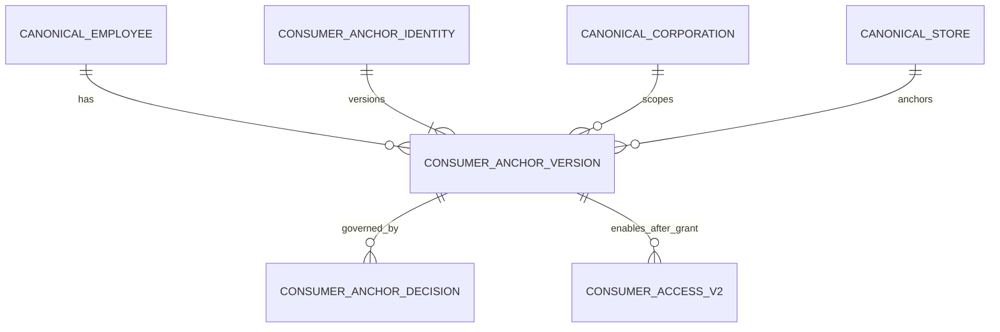

# Store Operations Consumer-Anchor Assignment Contract

**Status:** Owner decision recorded. Architecture only; no migration, database row, access binding, master population, or application connection has been created.

**Owner Decision:** `MODIFY AND ADOPT` the cross-corporation consumer-anchor model for Store Operations V1. The model is intentionally separate from normal HR employee/store assignments.

## 1. Purpose and Boundary

A consumer-anchor is a Canonical, effective-dated authorization relation. It establishes that a source-attested Canonical Employee may be considered for a named internal consumer in a named corporation. It is not an employment affiliation, staffing assignment, payroll allocation, attendance relation, production allocation, reporting line, or operational store-management assignment.

For Store Operations V1, the only approved intended users of this relation are the future, source-attested Representative and Vice President. A role name never creates scope. Runtime scope must resolve from the active Canonical Employee and an active Store Operations consumer-anchor, then be rechecked by the consumer access port.

This contract does not identify either person, an Employee UUID, an Auth subject, or an Assignment record. Those values remain out of scope until a later approved source snapshot and population run.

## 2. Contract Invariants

| Invariant | Contract rule |
|---|---|
| Purpose separation | `consumer_anchor` is a dedicated authorization purpose; it must not reuse `primary`, `secondary`, `temporary`, or `support` employee-store assignment semantics. |
| Consumer scoping | Each anchor names one `consumer_application`, initially `store_operations`. A Finance or future consumer receives no access by implication. |
| Corporation scoping | Each anchor names exactly one Canonical corporation. No `all`, global, or role-derived corporation scope exists. |
| Time semantics | The effective interval is `[effective_from, effective_to)`: `effective_from <= authorization_date` and `effective_to IS NULL OR authorization_date < effective_to`. |
| Deny by default | A missing, expired, revoked, mismatched-purpose, or mismatched-corporation anchor produces no scope. |
| Identity source | Employee identity comes from the approved Canonical Master source snapshot and later source-backed crosswalk. No role, email, display name, or handwritten UUID is a substitute. |
| Audit | Grant, revoke, and every approval have append-only evidence references, decision sequence, actor reference, and timestamp. |
| No automatic propagation | The anchor does not grant Finance, HUB, Talent, or any other application permission or data scope. |
| No operational side effect | Anchor records are excluded from HR, staffing, compensation, attendance, sales attribution, productivity, and manager-reporting projections. |

## 3. Logical Data Model

The names below are logical design names, not authored schema or migration objects.

| Logical object | Minimum content | Lifecycle |
|---|---|---|
| `consumer_anchor_identity` | Stable anchor identity, identity status, created/retired references | Immutable identity; retirement is an explicit state transition only under a later controlled writer contract. |
| `consumer_anchor_version` | Anchor identity/version, Canonical employee, `consumer_application`, explicit `purpose`, corporation, validating anchor store, effective interval, source snapshot provenance, approval reference, status, recorded timestamp | Immutable version. A changed purpose, corporation, store, or interval creates a successor version. |
| `consumer_anchor_decision` | Anchor version, access key, append-only grant/revoke decision sequence, effective timestamp, evidence reference, actor reference, reason/reference | Append-only. UPDATE/DELETE are prohibited. |

### 3.1 Required Attributes

| Attribute | Required rule |
|---|---|
| `consumer_application` | Exact controlled code, initially `store_operations`; no wildcard. |
| `purpose` | Controlled value for an internal-consumer authorization anchor. It is never a job title or HR assignment type. |
| `employee_id` | Canonical Employee only, selected through an approved source snapshot. No literals in migration or runtime code. |
| `corporation_id` | Exactly one Canonical corporation per anchor version. |
| `anchor_store_id` | One official Store Master store used only to prove the corporation/accounting relationship required by the later M019-compatible resolver. It does not give the person a store-manager role. |
| `effective_from`, `effective_to` | Required `[)` effective dating. No overlapping active anchor versions for the same employee/application/purpose/corporation. |
| `source_snapshot_id` | Provenance for the Canonical Employee, corporation, store, and relationship validation. It is not a claim that the Owner decision originated in the source system. |
| `approval_reference` | Structured non-secret Owner decision reference. |
| `evidence_reference` | Structured non-secret record of grant/revoke rationale; raw employee data, credentials, and connection details are prohibited. |

## 4. Representative and Vice President Scope Contract

The Store Operations V1 outcome is all official 20 stores across six corporations, but it is represented through six explicit corporation anchors per approved person, not by a global role or `all` scope.

| Corporation | Required future relation | Result after separate access binding |
|---|---|---|
| IDEA NOV | One active Store Operations consumer-anchor whose validating store has an active accounting relation to IDEA NOV | Permits the corporation's permitted official stores for `actual` and `budget` only |
| ALBERO | Same rule | Same rule |
| BIOEL | Same rule | Same rule |
| FILM | Same rule | Same rule |
| LUA | Same rule | Same rule |
| UNO | Same rule | Same rule |

The later Store Operations server path must still filter its returned set to the approved official Store Master projection of 20 stores. It must not treat the anchor as authorization for headquarters, legacy, virtual, inactive, unresolved, or future store rows. Direct/FC filtering only narrows the already returned permitted set; it never expands it.

The anchor itself is not an M019 grant. Each future grant remains a separate, append-only Consumer Access decision for one corporation and one scenario. Store Operations V1 permits only `actual` and `budget`; `forecast` is absent.

## 5. Separation From HR Assignments

`core.employee_store_assignments` is the existing effective-dated HR/operational Store Scope model. Its supported kinds are `primary`, `secondary`, `temporary`, and `support`. It remains the only approved source for Area Manager and Store Manager scope after source attestation.

| Topic | Normal employee-store assignment | Consumer-anchor |
|---|---|---|
| Meaning | Work/organizational relationship to a store | Internal Consumer authorization anchor |
| Population source | Canonical employment/assignment source evidence | Owner decision plus source-backed Canonical identity and organization validation |
| Role in Store Operations V1 | AM and Store Manager permitted-store derivation | Representative and Vice President corporation anchor only |
| `support` / `temporary` | Do not expand viewing scope | Never used as an anchor substitute |
| HR projections | May be included where legitimately required | Must be excluded |
| Finance propagation | Not automatic | Explicitly prohibited |

The model deliberately rejects the following shortcuts:

- encoding an executive authorization as a `secondary` work assignment;
- adding 20 artificial store work assignments to create all-store access;
- interpreting a role, department name, UI alias, or `scope_type = all` as an anchor;
- using an anchor to supply AM or Store Manager scope;
- using an anchor to infer an unproved Sales Department Head.

## 6. Runtime Resolution Contract

For the future Store Operations path, the resolver must perform this sequence server-side for every request and accounting period:

1. Resolve a verified identity to one Canonical Employee through the AUTH-01 crosswalk.
2. Reject an inactive, unresolved, or mismatched Canonical Employee.
3. Resolve active, non-revoked Store Operations consumer-anchor decisions as of the requested period.
4. Verify exact consumer application, purpose, corporation, effective period, validating anchor store, and current corporation/accounting relationship.
5. Intersect the result with the official 20-store Store Master projection and the requested filter.
6. Recheck the scenario is `actual` or `budget`.
7. Invoke the future M019-compatible access port, which independently rechecks the identity, anchor, scope, publication, and scenario.

Failure at any step returns no additional scope. A direct URL, browser role key, Preview fixture, or requested filter can never add stores.

## 7. Grant, Revoke, and Audit Contract

| Operation | Required behavior |
|---|---|
| Grant | Append a first `grant` decision only after the anchor version, source snapshot provenance, Owner reference, and corporation relationship are valid. |
| Modify | Create a new immutable anchor version and a new decision chain where corporation, purpose, store, or period changes. Do not overwrite the prior record. |
| Revoke | Append a `revoke` decision with effective time and reason reference. Future access stops; history remains. |
| Expire | Effective-date evaluation stops scope after `effective_to`; no implicit renewal exists. |
| Audit | Preserve approval/evidence references, version and decision sequence, timestamps, and a non-secret actor reference. Do not store credentials, raw tokens, or employee PII in the audit text. |

## 8. Consumer Reuse Rule

The relation is reusable in data shape, but not reusable as permission. A future consumer must satisfy all of the following before use:

1. a distinct `consumer_application` and approved purpose;
2. its own Owner authorization;
3. its own access-contract binding and data-scope review;
4. explicit test that Store Operations access is not widened or changed.

Finance is therefore excluded by default.

## 9. Acceptance Criteria for a Future Implementation Package

1. No HR assignment kind, UI role alias, Employee UUID literal, or role literal authorizes all-store scope.
2. Every Representative/Vice President scope is expressed as six source-backed corporation anchors, never one global row.
3. Exactly `actual` and `budget` can be bound for Store Operations V1; `forecast` remains absent.
4. An expired or revoked anchor produces a denial without fallback.
5. An anchor cannot influence HR, Finance, Talent, attendance, or sales attribution without a separate approved contract.
6. Grant/revoke history is append-only and rejects UPDATE/DELETE.
7. RLS is forced and direct table access is denied until a separately approved controlled-writer package exists.
8. M019 v1 remains intact; any compatibility work is additive and versioned.

## 10. Readiness

| Item | Status |
|---|---|
| Consumer-anchor architecture | **DESIGN READY** |
| Existing HR assignment reuse | **REJECTED** for executive consumer scope |
| Representative/Vice President population | Not authorized |
| Consumer-anchor migration authoring/apply | Not authorized |
| M019 alignment | Requires the separate additive corrective design in document 49 |
