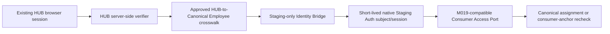

# Store Operations AUTH-01 Identity Bridge Contract

**Status:** Owner decision recorded. Architecture only; no Auth user, credential, token exchange, Edge Function, API, database row, or M019 binding has been created.

**Owner Decision:** Adopt a new, minimal Staging-only Identity Bridge that reuses existing HUB Session server-side verification. It is not a new general identity provider and does not reuse Production Auth subjects.

## 1. Existing Static Contract

| Subject | Static source result | AUTH-01 use |
|---|---|---|
| HUB session issuance | `nov-hub-api` issues an HMAC-signed, versioned HUB session with a fixed `nov_hub` audience and a 15-minute lifetime | Reused only after server-side verification |
| HUB session subject | The verified session subject is an existing HUB employee identifier | Input to the formal crosswalk, not a Staging Auth subject |
| HUB verification | Existing verifier checks signature, expected audience, UUID shape, expiry, and issued-at freshness | Mandatory first bridge check |
| Issuer assertion | Current payload does not rely on an `iss` claim; the signer is established by the HUB API verifier and its function-held signing material | A bridge must not invent or trust a new issuer claim |
| Firebase path | Existing HUB source includes server-side Firebase verification and a legacy email fallback path | The fallback is explicitly ineligible for AUTH-01 binding |
| Existing handoff | IDEA LINK has an opaque server-managed handoff for a different audience | Reference pattern only; not a Staging Auth exchange contract |
| Staging Auth | Prior aggregate attestation reported no Staging Auth users and no attested HUB-to-Staging exchange | Onboarding and bridge remain separate future gates |
| M019 | M019 requires a Staging `authenticated` JWT subject and re-evaluates Consumer Access | Defines the required Bridge output boundary |

## 2. Target Contract



The browser remains an untrusted presentation layer. It cannot choose the Canonical Employee, Staging subject, role, Store Scope, scenario, or M019 inputs beyond a validated user request. The bridge resolves identity server-side and returns generic success/failure only.

## 3. Identity Domains and One-to-One Binding

| Domain | Logical identifier | Authority |
|---|---|---|
| Existing HUB | Verified HUB Session subject | Existing HUB Session verifier |
| Core Master | Canonical Employee | Approved source snapshot and Canonical Master population |
| Staging Auth | Staging Auth subject | Approved Staging Auth onboarding |

The future crosswalk must have an active one-to-one temporal relation:

```text
verified_hub_employee_subject
  -> canonical_employee_id
  -> staging_auth_subject_id
```

The relation must record source snapshot/version provenance, effective interval, status, audit reference, and revoke reference. It must reject:

- one active HUB subject mapping to more than one Canonical Employee;
- one active Staging subject mapping to more than one Canonical Employee;
- email-only, display-name-only, or manually typed matching;
- Production Auth subject copying;
- mapping an inactive or unresolved Canonical Employee.

No raw UUID, email address, token, credential, or PII appears in a browser response, logs, or this documentation.

## 4. Bridge Request and Output Contract

### 4.1 Input

The bridge accepts only an existing authenticated HUB request through the existing server-side Authorization path. It does not read a token from browser storage and does not accept employee identity, role, Staging subject, or scope as request input.

Before any bridge operation, the server validates:

1. HUB signature using the existing function-held verifier material;
2. expected session type/version and `nov_hub` audience;
3. session expiry and issued-at sanity;
4. session identifier presence and replay state;
5. environment identity is exactly `idea-nov-staging` for the target bridge;
6. active HUB-to-Canonical-to-Staging identity binding;
7. active Canonical Employee status.

### 4.2 Output

The Bridge produces a **short-lived native Staging Auth session or credential** only through a Staging-supported, server-side issuance mechanism proven in a later technical implementation design. It must never use custom browser JWT signing or reveal a service credential.

The recommended transport is an opaque, secure, HTTP-only server session or a one-time exchange artifact. The raw Staging Auth credential remains server-held and is not rendered in the UI, URL, local storage, application state, analytics, error payload, or logs.

The exact maximum TTL is a controlled AUTH-01 contract value. The recommended design constraint is:

```text
staging_credential_expiry <= verified_hub_session_expiry
and staging_credential_ttl is short-lived
```

The implementation package may propose a concrete duration only with Security Owner review. It must also support immediate revocation.

## 5. Replay, Expiry, and Revocation

| Control | Required behavior |
|---|---|
| Replay prevention | Bridge exchanges are one-time and audience-bound. Record only a non-reversible identifier or digest of the verified session/exchange, plus consumption state and expiry. A consumed or expired exchange is rejected. |
| Expiry | Reject an expired HUB Session before crosswalk lookup. The Staging credential may never outlive the verified HUB session. |
| Revocation | Revoking the crosswalk, disabling the Staging Auth subject, expiring the bridge session, or appending an M019 revoke must all prevent future data access. The bridge must recheck active binding status on issuance/refresh. |
| Session rotation | A fresh verified HUB Session is required after expiry. No silent infinite refresh is allowed. |
| Audit | Store event type, safe actor reference, binding/version reference, environment, timestamp, result, and reason code. Never store raw bearer tokens or personal fields. |

## 6. Environment Separation

| Rule | Required behavior |
|---|---|
| Target | The Bridge accepts only the explicit Staging identity of `idea-nov-staging`. |
| Production | Any Production target, project identity mismatch, or Production Auth subject is rejected before credential issuance. |
| Audience | Every bridge artifact has a Store Operations Staging audience; it cannot be redeemed by a different internal app. |
| Credential material | Staging-only server-held credential material is isolated from HUB and Production. No browser exposure. |
| Logs | Token and credential values are redacted by construction; only safe outcome metadata is recorded. |

## 7. Authorization Is Separate From Authentication

Successful AUTH-01 bridge resolution establishes only a Staging Auth subject tied to one Canonical Employee. It does not grant:

- Store Operations application access;
- non-profit KPI visibility;
- profit or margin visibility;
- Corporation, Store, or Department scope;
- `forecast` scenario access;
- Finance, Talent, or HUB access.

Those decisions remain server-side and are later enforced by application permission/data-scope logic plus the M019-compatible Consumer Access resolver. M019 must recheck the current Canonical assignment or consumer-anchor for every requested accounting period.

## 8. Required Future Implementation Evidence

Before AUTH-01 authoring or deployment, all items below need separate approval and proof:

1. A supported server-side Staging Auth session-issuance operation, with no custom JWT signing.
2. A source-backed one-to-one HUB subject to Canonical Employee crosswalk.
3. A source-backed Canonical Employee to Staging Auth subject onboarding record.
4. Staging project identity, audience, TTL, exchange-consumption, and revocation test evidence.
5. Negative tests for invalid signature, audience mismatch, expiry, replay, inactive employee, revoked crosswalk, environment mismatch, and direct unauthenticated M019 call.
6. Security review proving no token UI or log exposure and no browser service credential.

## 9. Rejected Designs

- service credential in a browser or frontend bundle;
- client-side creation or signing of a JWT;
- extracting an identity token from local storage or using a UI role key as evidence;
- copy/reuse of a Production Auth subject in Staging;
- automatic email or display-name binding;
- handwritten Employee UUID or Staging subject input;
- a generic token that is accepted across HUB, Finance, Talent, and Store Operations;
- bypassing M019 with a privileged server credential.

## 10. Readiness

| Item | Status |
|---|---|
| Existing HUB Session server-side verification | **CONFIRMED** by static source review |
| Formal HUB-to-Canonical Employee crosswalk | **NOT POPULATED / NOT ATTESTED** |
| Formal Canonical Employee-to-Staging Auth crosswalk | **NOT POPULATED / NOT ATTESTED** |
| Existing reusable HUB-to-Staging Auth exchange | **NOT ATTESTED** |
| AUTH-01 architecture | **DESIGN READY** |
| AUTH-01 implementation/onboarding | **NOT AUTHORIZED** |
