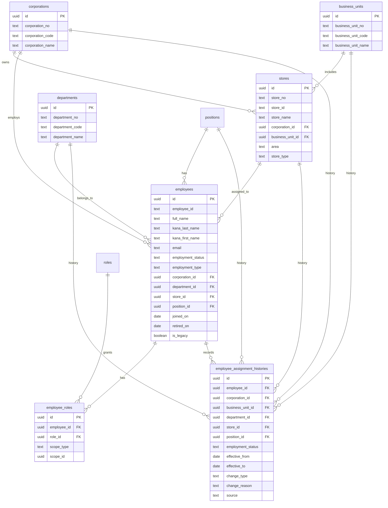

# IDEA NOV Platform Core社員台帳 v1 レビュー成果物

作成日: 2026-06-23  
状態: レビュー用。まだSupabaseへ投入しない。

## 0. 判断

今回の目的は、人事労務システム本体を内製することではなく、IDEA NOV Platform全体で共通利用する「社員台帳の背骨」を作ること。

KING OF TIME 勤怠、KING OF TIME 人事労務は当面継続利用する。Core DBは、NOV HUB、売上管理、経営管理、サンクスコイン、人財投資管理、タスク管理、環境整備、教育部WEBが共通参照する社員・所属・権限・履歴の基盤とする。

## 1. ER図



## 2. CREATE TABLE SQL

```sql
create extension if not exists pgcrypto;

create table if not exists public.corporations (
  id uuid primary key default gen_random_uuid(),
  corporation_no text not null unique check (corporation_no ~ '^[0-9]{4}$'),
  corporation_code text not null unique,
  corporation_name text not null,
  created_at timestamptz not null default now(),
  updated_at timestamptz not null default now(),
  is_active boolean not null default true
);

create table if not exists public.business_units (
  id uuid primary key default gen_random_uuid(),
  business_unit_no text not null unique check (business_unit_no ~ '^[0-9]{4}$'),
  business_unit_code text not null unique,
  business_unit_name text not null,
  created_at timestamptz not null default now(),
  updated_at timestamptz not null default now(),
  is_active boolean not null default true
);

create table if not exists public.departments (
  id uuid primary key default gen_random_uuid(),
  department_no text not null unique check (department_no ~ '^[0-9]{4}$'),
  department_code text not null unique,
  department_name text not null,
  created_at timestamptz not null default now(),
  updated_at timestamptz not null default now(),
  is_active boolean not null default true
);

create table if not exists public.positions (
  id uuid primary key default gen_random_uuid(),
  position_no text not null unique check (position_no ~ '^[0-9]{4}$'),
  position_name text not null unique,
  created_at timestamptz not null default now(),
  updated_at timestamptz not null default now(),
  is_active boolean not null default true
);

create table if not exists public.roles (
  id uuid primary key default gen_random_uuid(),
  role_no text not null unique check (role_no ~ '^[0-9]{4}$'),
  role_key text not null unique,
  role_name text not null,
  created_at timestamptz not null default now(),
  updated_at timestamptz not null default now(),
  is_active boolean not null default true
);

create table if not exists public.stores (
  id uuid primary key default gen_random_uuid(),
  store_no text not null unique check (store_no ~ '^[0-9]{4}$'),
  store_id text not null unique,
  store_name text not null,
  corporation_id uuid references public.corporations(id),
  business_unit_id uuid references public.business_units(id),
  area text,
  store_type text,
  created_at timestamptz not null default now(),
  updated_at timestamptz not null default now(),
  is_active boolean not null default true
);

create table if not exists public.employees (
  id uuid primary key default gen_random_uuid(),
  employee_id text not null unique,
  full_name text not null,
  kana_last_name text,
  kana_first_name text,
  email text,
  employment_status text,
  employment_type text,
  corporation_id uuid references public.corporations(id),
  department_id uuid references public.departments(id),
  store_id uuid references public.stores(id),
  position_id uuid references public.positions(id),
  joined_on date,
  retired_on date,
  firebase_uid text unique,
  is_legacy boolean not null default false,
  source_row jsonb not null default '{}'::jsonb,
  created_at timestamptz not null default now(),
  updated_at timestamptz not null default now(),
  is_active boolean not null default true
);

create table if not exists public.employee_roles (
  id uuid primary key default gen_random_uuid(),
  employee_id uuid not null references public.employees(id) on delete cascade,
  role_id uuid not null references public.roles(id),
  scope_type text not null default 'all' check (scope_type in ('all','corporation','business_unit','department','store','self')),
  scope_id uuid,
  created_at timestamptz not null default now(),
  updated_at timestamptz not null default now(),
  is_active boolean not null default true,
  unique (employee_id, role_id, scope_type, scope_id)
);

create table if not exists public.employee_assignment_histories (
  id uuid primary key default gen_random_uuid(),
  employee_id uuid not null references public.employees(id) on delete cascade,
  corporation_id uuid references public.corporations(id),
  business_unit_id uuid references public.business_units(id),
  department_id uuid references public.departments(id),
  store_id uuid references public.stores(id),
  position_id uuid references public.positions(id),
  employment_status text,
  effective_from date not null,
  effective_to date,
  change_type text not null check (change_type in ('join','transfer','promotion','demotion','leave','return','retire','fc_transfer','correction')),
  change_reason text,
  source text not null default 'manual',
  created_at timestamptz not null default now(),
  updated_at timestamptz not null default now(),
  is_active boolean not null default true,
  check (effective_to is null or effective_to >= effective_from)
);

create index if not exists idx_employees_employee_id on public.employees(employee_id);
create index if not exists idx_employees_email on public.employees(email);
create index if not exists idx_employees_store_id on public.employees(store_id);
create index if not exists idx_assignment_histories_employee_id on public.employee_assignment_histories(employee_id);
create index if not exists idx_assignment_histories_effective_from on public.employee_assignment_histories(effective_from);
```

## 3. 初期マスタ投入SQL

```sql
insert into public.corporations (corporation_no, corporation_code, corporation_name) values
('0001','IDEA_NOV','IDEA NOV'),
('0002','ALBERO','ALBERO'),
('0003','UNO','UNO'),
('0004','BIOEL','BIOEL'),
('0005','FILM','FILM'),
('0006','LUA','LUA')
on conflict (corporation_no) do update set
  corporation_code = excluded.corporation_code,
  corporation_name = excluded.corporation_name,
  updated_at = now();

insert into public.business_units (business_unit_no, business_unit_code, business_unit_name) values
('0001','BASSA','BASSA事業'),
('0002','COLOR','カラー専門店事業'),
('0003','EC','EC事業')
on conflict (business_unit_no) do update set
  business_unit_code = excluded.business_unit_code,
  business_unit_name = excluded.business_unit_name,
  updated_at = now();

insert into public.departments (department_no, department_code, department_name) values
('0001','BOARD','取締役会'),
('0002','SALES','営業部'),
('0003','EDU','教育部'),
('0004','EC','EC事業部'),
('0005','HR','総務人事部'),
('0006','ACCOUNTING','経理部')
on conflict (department_no) do update set
  department_code = excluded.department_code,
  department_name = excluded.department_name,
  updated_at = now();

insert into public.positions (position_no, position_name) values
('0001','会長'),
('0002','社長'),
('0003','副社長'),
('0004','執行役員'),
('0005','部長'),
('0006','エリアマネージャー'),
('0007','SD'),
('0008','副店長'),
('0009','チーフ'),
('0010','スタイリスト'),
('0011','アシスタント'),
('0012','本部スタッフ'),
('0013','FCオーナー')
on conflict (position_no) do update set
  position_name = excluded.position_name,
  updated_at = now();

insert into public.roles (role_no, role_key, role_name) values
('0001','super_admin','システム管理者'),
('0002','executive','経営層'),
('0003','department_manager','部門管理者'),
('0004','area_manager','エリア管理者'),
('0005','store_manager','店舗管理者'),
('0006','staff','スタッフ'),
('0007','fc_owner','FCオーナー'),
('0008','trainer','教育担当'),
('0009','backoffice','総務人事'),
('0010','accounting','経理')
on conflict (role_no) do update set
  role_key = excluded.role_key,
  role_name = excluded.role_name,
  updated_at = now();
```

店舗は手打ち投入しない。店舗情報シートから全件同期する。

## 4. 社員同期仕様書

正: 社員名簿（AI分析対応）

同期対象:

- 社員番号 -> employees.employee_id
- 氏名 -> employees.full_name
- フリガナ -> kana_last_name / kana_first_name
- メールアドレス -> email
- 所属会社 -> corporation_id
- 所属店舗 -> store_id
- 所属部署 -> department_id
- 役職 -> position_id
- 雇用形態 -> employment_type
- 現職 -> employment_status / is_active
- 入社日 -> joined_on
- 退職日 -> retired_on

同期しない:

- PIN
- マイナンバー
- 銀行口座
- 年金番号
- 健康保険番号
- 雇用保険番号
- 家族情報
- 緊急連絡先
- 通勤経路
- 住所詳細

社員番号なし退職者:

- `LEGACY-0001` 形式で `employee_id` を生成
- `is_legacy = true`

## 5. 店舗同期仕様書

正: 店舗設備等情報（AI対応ソース）

同期対象:

- store_no
- NOV_店舗ID -> stores.store_id
- 店舗名 -> stores.store_name
- 所属 -> corporation_id / business_unit_id 判定
- NOV_エリア -> area
- NOV_種別 -> store_type
- 状況 / NOV_利用可否 -> is_active

同期しない:

- NOV_店舗PASS

## 6. employee_assignment_histories仕様書

目的:

- employees は現在状態
- employee_assignment_histories は履歴状態

保持する履歴:

- 入社: join
- 異動: transfer
- 昇格: promotion
- 降格: demotion
- 休職: leave
- 復職: return
- 退職: retire
- FC移管: fc_transfer
- 修正履歴: correction

運用ルール:

- 履歴は上書き禁止
- 常に追記
- 現在状態を変える場合は、employees更新と同時に履歴を1行追加
- 期間が終わる履歴は effective_to を入れる
- 不明な過去履歴は source = `legacy_import`

## 7. 将来の人事労務拡張設計

今回は作らない。

将来候補:

- employee_profiles
- employee_addresses
- employee_emergency_contacts
- employee_commuting
- employee_bank_accounts
- employee_social_insurance
- employee_tax_information
- employee_private_documents
- employee_contracts
- employee_histories

方針:

- Core社員台帳には最小限の基本情報だけ置く
- 機微情報は用途別テーブルへ分離
- 経理部・総務人事部のみアクセス可能にする
- 暗号化またはSupabase Vault等の利用を検討

## 8. セキュリティレビュー

Core社員台帳 v1に保存しない:

- マイナンバー
- 銀行口座
- 年金番号
- 健康保険番号
- 雇用保険番号
- 住民税情報
- 家族情報
- 緊急連絡先
- 通勤経路
- 住所詳細

注意:

- service_role keyはGAS等のサーバー側だけに置く
- GitHub Pagesなどフロントには絶対に置かない
- Firebase UIDは社員本人のログイン紐付け用途に限定
- 退職者は `is_active=false` にして各アプリ表示対象から外す
- 休職者は退職者と分けて管理する

## 9. Supabase投入前チェックリスト

- [ ] 既存DBとの差分を確認した
- [ ] `corporation_code` が corporations に存在するか確認した
- [ ] stores に `area`, `store_type` を追加するか確認した
- [ ] employees の日付カラム名を `hire_date` ではなく `joined_on` に寄せるか決定した
- [ ] 既存の `source_row` を残すか決定した
- [ ] `employee_assignment_histories` を追加する前に過去履歴の初期化方針を決定した
- [ ] 退職者・休職者の `employment_status` 正規化ルールを決定した
- [ ] PINを同期しないことを確認した
- [ ] NOV_店舗PASSを保存しないことを確認した
- [ ] 管理画面の編集項目を再確認した
- [ ] 総務人事・経理向けの権限設計を別途レビューする

## 10. 現在実装との差分メモ

現時点のSupabaseには、既にCore DB v1相当のテーブルと管理画面がある。  
このレビュー版へ寄せる場合、いきなりDROP/作り直しはしない。

安全な移行手順:

1. 既存テーブルのカラム差分を確認
2. 足りないカラムのみ `alter table` で追加
3. 既存データを壊さない
4. 管理画面の参照カラムを段階的に変更
5. employee_assignment_histories を追加
6. 退職・異動・休職処理時に履歴追記する

