# ADR-003: Store History Model

## Status

Proposed。

## Decision

店舗は閉店、改名、Direct/FC変更、運営法人変更があっても同一entityを維持する。`store`には不変identityと現在の基本属性を持たせ、運営主体・Direct/FC・有効期間は`store_operation_history`へ分離する。

## Recommended logical model

```mermaid
erDiagram
  STORE ||--o{ STORE_OPERATION_HISTORY : "has operating periods"
  CORPORATION ||--o{ STORE_OPERATION_HISTORY : "operates"
  STORE ||--o{ STORE_NAME_HISTORY : "has names"
  STORE ||--o{ STORE_SOURCE_IDENTITY : "maps source keys"

  STORE {
    uuid store_uuid PK
    text store_code UK
    text store_no UK
    text status
    timestamptz created_at
    timestamptz updated_at
  }
  STORE_OPERATION_HISTORY {
    uuid operation_history_uuid PK
    uuid store_uuid FK
    uuid operating_entity_uuid FK
    text direct_or_fc
    date effective_from
    date effective_to
    integer version
    text record_status
  }
  STORE_NAME_HISTORY {
    uuid store_name_history_uuid PK
    uuid store_uuid FK
    text official_name
    text display_name
    text brand_name
    date effective_from
    date effective_to
  }
  STORE_SOURCE_IDENTITY {
    uuid store_source_identity_uuid PK
    uuid store_uuid FK
    text source_system
    text source_key
    date effective_from
    date effective_to
  }
```

## Temporal rules

- `effective_from`はinclusive、`effective_to`はexclusive。現在行は`effective_to = NULL`。
- 同一storeの有効な`store_operation_history`期間は重複禁止。
- 現在日時に一致するactive operationは最大1件。
- Direct/FCは運営法人からUIが推測せず、履歴行の明示属性として扱う。
- 過去月のAccounting/Store Salesは対象月時点のoperationを解決する。
- 移管日は旧行を終了し、新行を同日開始する。同じstore UUIDを継続する。
- 閉店はstore UUIDを削除せず、statusとoperation periodを閉じる。

## Correction and audit

過去行をsilent update/deleteしない。誤りの訂正は、旧行を`superseded`として参照可能に保ち、訂正理由・承認者・correlation IDを持つ後続versionを追加する。effective dateの遡及変更はAccounting Ownerへの影響確認を必須とする。

## Accounting consistency

Accounting Coreはstore・corporationを複製せずUUID参照する。月次factは取込・確定時に解決したstore UUIDとlineageを保持し、過去の運営法人変更で既確定会計値を黙って付け替えない。

## Non-decision

物理schema名、index、constraint実装、backfill SQLはmigration設計時に決める。本ADRでは作成しない。
