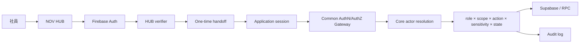
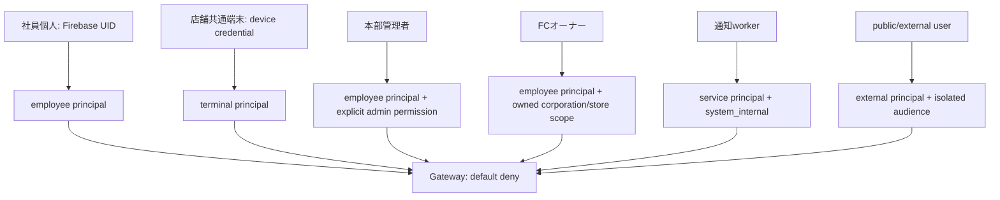

# Target Authentication Architecture

## Principal別

- 店舗共通端末を社員個人として扱わない。端末操作で個人actionが必要なら、端末session内で短寿命のemployee step-upを行い両principalを監査する。
- platform_adminは業務PII閲覧を自動取得しない。
- public/external機能はemployee audienceとsessionを共有せず、公開resourceだけを許可する。
- server-to-serverは人間actionを代行せず、明示的 `system_execute` のみ許可する。

## Trust boundary

Browserはtoken保持・handoff開始まで。actor、role、scope、resource stateはserverが再取得する。DBは可能な限りactor/storeを再検証する。service roleは認証手段ではなく、認可後のDB credentialである。
