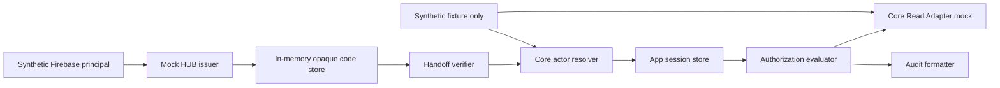

# Sandbox Architecture

## Trust boundaries

- Browser相当の入力はopaque code、session ID、resource/actionのみ。
- `employee_id`、`store_id`、`corporation_id`はactor正本として採用しない。
- employeeはFirebase UIDから、terminal/serviceは専用IDとapp allowlistから解決する。
- adapterだけがfixture構造を読み、利用側はemployees/stores/corporations配列へ直接依存しない。
- event formatterはallowlist方式で、入力のSecretや氏名をコピーしない。

## Sandbox atomicity

one-time codeは同期的な`Map.delete`を値返却前に実行し、同一process内の二重交換を拒否する。本番ではtransactional storeまたは原子的なcompare-and-deleteが必要であり、このmockは分散競合の証明ではない。

## Cookie contract

`__Host-nov_app_session; HttpOnly; Secure; SameSite=Lax; Path=/`を返却仕様として検証する。テストはHTTP server/browserを起動せず、Cookie属性contractだけを確認する。
