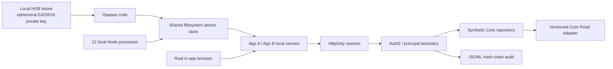

# Staging Architecture

## Isolation

- Firebase、Supabase、production DB、service role、production Secret、外部networkを使用しない。
- Ed25519 key pairはprocess内で毎回生成し、export・commitしない。
- employee/store/corporationはPhase 5 synthetic fixtureだけ。
- one-time storeとauditはOS一時ディレクトリに生成し、test cleanupで削除。
- local serverは`127.0.0.1:4310-4312`だけでlistenし、検証後停止。

共有filesystem storeは複数processのatomicity検証用であり、複数hostの代替ではない。本番候補はRedis/Upstash/staging DB/durable KVの条件付きcompare-and-delete。
