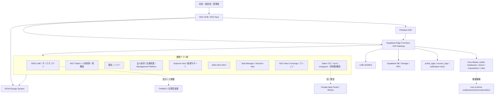

# IDEA NOV OS アーキテクチャマップ

## 境界原則

- 本人認証はFirebase Auth、認可はserver側のrole × scope × action、データ正本はSupabase Core。
- `public.employees/stores/corporations` が現行物理正本候補。`core`同名表は1件ずつで将来モデル候補。
- browserからservice roleを使わない。actor IDをrequest bodyだけで信用しない。
- NOV HUBのログイン後カード正本は `public.portal_apps`。`portal/apps.json` と `portal/js/apps.js` は表示・fallback資料。
- GAS/Sheetsは通常運用正本から退役方向だが、教育・旧THANKS・外部アプリに残存可能性がある。

