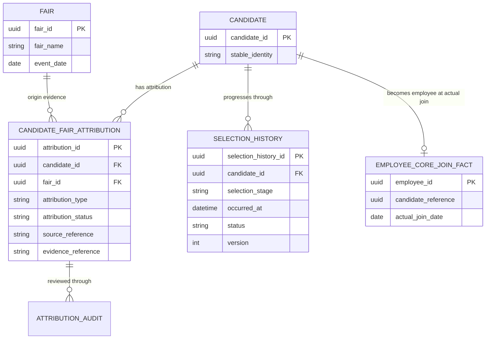

# NOV Talent Fair Attribution Contract Design

Status: `WORKFLOW_STAGING_READY / POPULATION_NOT_EXECUTED / KPI_NOT_RELEASED`

この設計は、Fairを起点とする面接・内定・採用KPIを、推測や既存の初期値ではなく、監査可能な正式事実から生成するための契約です。Candidate–Fair AttributionとHuman Review WorkflowはStagingへ適用済みですが、実データPopulationと正式KPI公開は未実施です。

## 判定

- Fairの接触・LINE登録・見学実績は、現行の正式Fairデータを利用できます。
- `interview_count`、`offer_count`、`hire_count` の既存値は正式事実として利用できません。
- 面接・内定は、Candidate–Fair Attributionが`CONFIRMED`であり、Selection Historyに正式事実がある場合のみ導出します。
- Fair成果の採用数は、Business Owner承認により内定数と同義です。UIでは原則「内定数」「内定率」「内定単価」と表示します。
- 公開条件を満たすまでは、面接・内定・採用および派生率・単価を「集計準備中」とします。

## ER diagram

## Source of Truth

| Domain | 正式Source | 責務 | Fair KPIでの利用 |
|---|---|---|---|
| Fair | Fair Master | フェア名、開催日、費用、接触、LINE登録、見学等 | 接触・LINE登録・見学の原数 |
| Candidate | Candidate | 入社前の人物同一性 | KPIのdistinct単位 |
| Fair起点 | Candidate–Fair Attribution | CandidateがどのFairを起点とするか | `CONFIRMED`のみ利用 |
| 選考 | Selection History | 面接、内定等の発生事実 | 面接・内定の正式Source |
| 入社 | Employee Core | 実入社の正式事実 | 「採用=実入社」の場合のみread-only照合 |
| 既存Fair KPI列 | Fair Master内のlegacy列 | 互換表示候補 | 正式Sourceとして利用禁止 |

## 設計成果物

- [Fair Attribution Contract](./fair-attribution-contract.md)
- [Machine-readable Contract](./fair-attribution-contract.json)
- [Human Review Workflow](./human-review-workflow.md)
- [Legacy Fair KPI ADR](./legacy-fair-kpi-adr.md)
- [Publication Gate](./publication-gate.md)

## 影響整理

### Migration impact

Candidate–Fair Attributionとappend-only監査証跡のschemaはStagingへ適用済みです。Candidate、Fair、Selection、Employee Coreを変更せず、Attribution / Audit実データは0件を維持しています。PopulationはDB司令塔のData GateとOwner明示承認なしに実行しません。

### API impact

Attributionの参照、確認、却下、保留はserver-side APIで提供済みです。Review APIはWorkspace初期表示と分離され、Workspace Contract `1.0.0`を変更しません。将来Workspaceへ項目追加する場合は、同一正本SchemaからAPI、Validator、Type、Testを生成し、契約Versionと後方互換公開手順を更新します。

### UI impact

管理画面のHuman Review QueueはStaging公開済みで、一意候補と複数候補をCandidate単位で表示します。実データPopulation前のためQueueは空です。Fair詳細の正式下位KPIは、Attribution確認とSelection History整備まで未確定値を0へ変換せず「集計準備中」と表示します。

## Blockers

1. Candidate–Fair Attributionを証明できる正式Sourceまたは人間確認手順の承認。
2. Selection Historyを面接・内定の正式Sourceとする業務承認。
3. 既存データに対するAttributionの確認可能範囲と未確認分の扱い。
4. KPIの分母定義（面接率、内定率）の承認。

## Non-goals

- 自動紐付け、自動統合、自動削除
- 氏名、学校、日付の近似による推測
- DB・Spreadsheet・Productionへの書込み
- legacy 0値の正式実績への昇格
