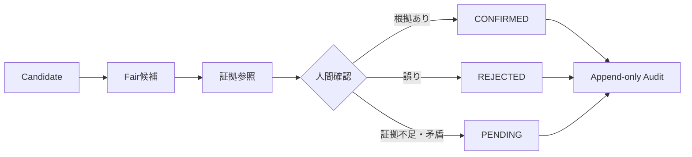

# Human Review Workflow

## Fixed flow

## Roles

- `hr.staff`: Attribution候補と証拠参照を登録し、`PENDING`を作成できる。
- `hr.admin` / `backoffice`: 証拠を確認して`CONFIRMED`または`REJECTED`を確定できる。
- `executive`: read-only。
- その他社員: アクセス不可。

実際の正式Role名は既存Permission Modelへマッピングし、新Roleを追加しません。

## Required audit facts

- attribution_id
- before_status / after_status
- decision_reason_code
- evidence_reference
- decided_by（actor ID）
- decided_by_role
- decided_at
- version

個人名、電話番号、email、LINE値、生の証拠本文を監査ログや成果物へ記録しません。

## Review rules

- Candidateの同一性確認とFair起点確認を別工程として扱います。
- 名前、学校、卒年、日付の近さだけで確定しません。
- 複数候補や矛盾がある場合は`PENDING`を維持します。
- 確定後の訂正は履歴を消さず、新しいversionと監査イベントで残します。
- KPI再計算は`CONFIRMED`の確定後に行います。

## Questions for 総務人事部

1. 各フェアで接触した学生を特定できる記録はありますか。
2. その学生が面接や内定へ進んだことを確認できる記録はありますか。
3. 面接率は、接触者、LINE登録者、見学者のどれを分母にしますか。
4. 内定率は、接触者、LINE登録者、見学者、面接者のどれを分母にしますか。

Fair成果の採用数は内定数と同義で承認済みです。実入社は別指標として扱います。
