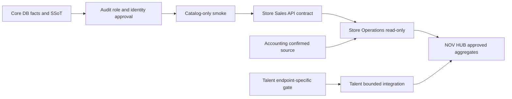

# IDEA NOV Platform Release Plan: 1.0 to 1.1

## Purpose and boundary

This is an integration roadmap, not a release authorization. It creates no release tag, merge, deployment, database connection, migration, or production data operation.

## Release principles

1. A release contains only independently verified changes with an explicit owner.
2. A UI release must not imply that an unavailable API or production data source is ready.
3. Core DB facts, production access, and business mutations each have separate gates.
4. A blocked domain may remain visibly `準備中`; it must not block unrelated static/UI work.
5. Every release has a known rollback target before approval.

## Release 1.0: Safe platform baseline

**Goal:** Give users a coherent HUB entry point and locally verifiable operational views without claiming production integration where none is approved.

| Domain | Included scope | Entry gate | Exit evidence | Explicitly excluded |
| --- | --- | --- | --- | --- |
| NOV HUB | Platform home, app registry navigation, legacy discovery route, support route, static notifications/Today placeholders | frontend boundary tests | accessibility/mobile/static tests, no fake data | new auth, API, DB, Edge, notification send |
| Store Operations | Local CSV-only analysis and read-only readiness surfaces | local fixture and UI tests | CSV parser/visual checks; pending states preserved | production DB/API access, write/approval/recalculation |
| NOV Talent | Existing UI, CSV validation/normalization, staging-readiness guidance | Talent local test suite | validation/sanitization tests; unavailable integration shown honestly | canonical promotion, employee-master writes, unapproved staging |
| Core DB | Governance, SSoT/UUID audit packages, read-only runner design/readiness | source/static review | approval pack + fake DB tests | production SELECT, role creation, migration/RLS changes |
| Accounting Core | Local P/L and aggregate analysis contract | fixture/static review | aggregate-only parser and display checks | production import, financial write, unconfirmed-period publication |

**1.0 release decision:** All included changes must be static/local-only or already independently production-approved. Any `準備中`, `未接続`, `CSV待ち`, or `未確定` state remains visible and truthful.

## Release 1.1: Governed read-only integration

**Goal:** Add approved, bounded read-only integrations after production facts and access controls have passed their own gates.

| Domain | Candidate capability | Required prior approval | Release evidence | Stop condition |
| --- | --- | --- | --- | --- |
| Core DB | Catalog-only production audit | D01-D10 board, sealed runner, audit role, controlled smoke | sanitized receipt with rollback | identity/role/query mismatch |
| Store Operations | Store Sales read-only route | formal SSoT, Store Sales API contract, HUB session/server scope review | contract tests + read-only smoke | mock fallback, missing scope, unconfirmed data |
| Accounting Core | Confirmed monthly profit/readiness source | accounting owner confirms source/formula/period | fixture + approved read-only response contract | missing `confirmed_through_period` or ambiguous source |
| NOV Talent | Approved historical/28 graduate read-only or staging follow-up | Talent-specific endpoint restoration and separate owner gate | bounded receipt | DNS/identity/staging gate failure |
| NOV HUB | Connect only approved aggregate providers | per-domain owner/scope confirmation | contract and UI boundary tests | any provider unavailable or unverified |

1.1 does **not** authorize a shared service role, direct browser-to-DB access, migration, canonical promotion, or automatic fallback to mock data.

## Critical path

## Cross-release acceptance

- No unreviewed production dependency is silently enabled.
- Each included change has tests and a rollback target.
- Release notes list intentionally pending integrations.
- Release 1.1 can be split by domain if a dependency remains blocked.
