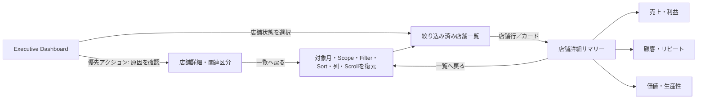

# Dashboard Wireframe

本資料は実装コードではない。`[選択]`はクリック／tap可能、`▼`は折りたたみ可能を表す。

## PC Executive Dashboard

```text
┌──────────────────────────────────────────────────────────────────────────┐
│ 店舗営業管理                    対象月 2026年7月  月次  全店  最終更新… │
│                                利益: 2026年6月 確定                     │
├──────────────────────────────────────────────────────────────────────────┤
│ 全店の状況                                                             │
│ 全○店舗のうち2店舗が要対応。売上よりリピート率低下を優先確認。       │
│ 総売上（税込）        直営店利益（対象○店）  要対応                    │
│ ¥xxx,xxx,xxx          ¥xx,xxx,xxx 確定       2 / 20                    │
│ 売上対象○店          FC利益はV1対象外        好調3 安定10 改善5 要対応2│
├──────────────────────────────────────────────────────────────────────────┤
│ 優先して確認すること（最大3件）                                        │
│ ┌改善テーマ1────┐ ┌改善テーマ2────┐ ┌改善テーマ3────┐ │
│ │店舗・状態・KPI│ │店舗・状態・KPI│ │店舗・状態・KPI│ │
│ │差分・影響度   │ │差分・影響度   │ │差分・影響度   │ │
│ │次に確認       │ │次に確認       │ │次に確認       │ │
│ │[原因を確認]   │ │[内訳を確認]   │ │[推移を確認]   │ │
│ └───────────┘ └───────────┘ └───────────┘ │
├──────────────────────────────────────────────────────────────────────────┤
│ 業績を動かした要因                                                       │
│ [結果]          [顧客]          [価値]          [継続・運営]             │
│ 主KPI＋比較     主KPI＋内訳     主KPI＋補助     主KPI＋補助              │
│ ───────── 共通推移: 当年 / 前年 / [予算を表示] ───────── │
├──────────────────────────────────────────────────────────────────────────┤
│ 店舗状態 [要対応 2] [改善中 5] [安定 10] [好調 3] [すべて 20]          │
├──────────────────────────────────────────────────────────────────────────┤
│ 店舗一覧（要対応2件）                   [列表示] [並び順]               │
│ 店舗・状態│改善テーマ│売上│利益状態│予算比│前年比│客数│Repeat│…      │
│ [店舗行→店舗詳細]                                                        │
└──────────────────────────────────────────────────────────────────────────┘
```

目的は上から「状態→優先→原因→店舗」の順に視線を動かすこと。主要クリック先はAction、Driverの推移、状態Filter、店舗行である。

## Tablet Executive Dashboard

```text
┌──────────────────────────────────────┐
│ Header / 対象月 / Scope / 利益状態   │
├──────────────────────────────────────┤
│ Summary結論                          │
│ 売上｜利益状態｜要対応               │
├──────────────────────────────────────┤
│ 優先1                 優先2          │
│ 優先3（幅により全幅）                │
├──────────────────────────────────────┤
│ 結果                  顧客           │
│ 価値                  継続・運営     │
│ 共通推移                              │
├──────────────────────────────────────┤
│ 状態Selector                          │
│ 主要列一覧／行展開 [店舗詳細]         │
└──────────────────────────────────────┘
```

hoverなし。補足はtapで開く。店舗一覧は主要列を優先し、補助KPIは行展開する。

## Mobile Executive Dashboard

```text
┌──────────────────────────┐
│ 店舗営業管理             │
│ 2026年7月・全店・月次    │
│ 直営店利益 対象○店 集計中│
├──────────────────────────┤
│ 全店の状況               │
│ 結論（最大3行）          │
│ 売上 / 直営利益状態 / 要対応│
│ 状態件数                 │
├──────────────────────────┤
│ [要対応2][改善5][安定10] │
├──────────────────────────┤
│ 優先1 [原因を確認]       │
│ 優先2 [内訳を確認]       │
│ 優先3 [推移を確認]       │
├──────────────────────────┤
│ ▼ 結果（初期展開）       │
│ ▶ 顧客                   │
│ ▶ 価値                   │
│ ▶ 継続・運営             │
├──────────────────────────┤
│ [Filter 2件適用]         │
│ 店舗カード [詳細]        │
│ 店舗カード [詳細]        │
└──────────────────────────┘
```

横スクロールは使わない。Filterはbottom sheet暫定案。tap領域は44px以上。

## 店舗一覧

```text
PC:      [Scope] [状態] [並び順] [列表示]
         sticky 店舗・状態 | 改善テーマ | 主数値・比較 | …
         行全体 [店舗詳細]

Mobile:  店舗名  [要対応]
         改善テーマ
         売上 / 利益状態 / 最重要差分
         [原因を確認]
```

空状態は「該当する店舗はありません」＋「全店舗を見る」。自動的にFilterを変えない。

## 店舗詳細サマリー

```text
┌──────────────────────────────────────────────────┐
│ [← 一覧へ戻る]                                   │
│ 立川店 [要対応]  2026年7月  直営利益: 集計中     │
│ 新規リピート率が低下。集客より予約工程を確認。   │
│ 今月の最優先課題 / 次に確認すること              │
├──────────────────────────────────────────────────┤
│ 売上 │ 利益状態 │ 客数 │ 単価 │ Repeat │ 生産性 │
├──────────────────────────────────────────────────┤
│ [サマリー][売上・利益][顧客・リピート][価値・生産性] │
│ 選択区分の詳細                                   │
└──────────────────────────────────────────────────┘
```

## 売上・利益

```text
総売上（税込）
├─ 店舗売上 ─ [技術][通常店販][MID]
└─ EC按分売上（別Source／二重計上なし）

[横型積み上げ構成bar]
利益: 確定値 / 集計中＋予定 / 準備中 / FCはV1対象外
月別推移: 当年 ── 前年 ── [予算]
```

主KPIは総売上と利益。補助は予算比、前年比、年間累計。EC按分未承認時は準備中。

## 顧客・リピート

```text
総客数（主）        総リピート率（主）
新規 / 既存         [展開] 新規 / 再来 / 固定
前年比              12か月 当年 / 前年
```

## 価値・生産性

```text
総単価（主）        総生産性（主）
技術単価            稼働スタッフ数 14.2人相当 [算出条件]
店販売上            店販購買率
```

算出条件はtap／focusで確認可能にし、tooltipだけに依存しない。

## 画面遷移



## 状態別Wireframeルール

| 状態 | 領域 | 表示 |
| --- | --- | --- |
| Loading | 画面全体 | 読み込み中。業務の集計中とは別表現 |
| 集計中 | KPI値 | 集計中＋確定予定。0やskeletonなし |
| 準備中 | KPI値 | 準備中＋理由。領域維持、無効導線なし |
| Empty | 一覧／Action | 0件理由＋条件を保った次導線 |
| Error | 対象領域 | 取得失敗＋再試行。既存値を当月値として残さない |
| Unauthorized | 画面 | HUBログイン案内 |
| Forbidden | 画面 | 権限なし＋HUBへ戻る |
| API未接続 | 画面 | 503 接続準備中。利益集計中とは分離 |
| Preview | 画面 | Preview・Mock値・実績値ではない |
