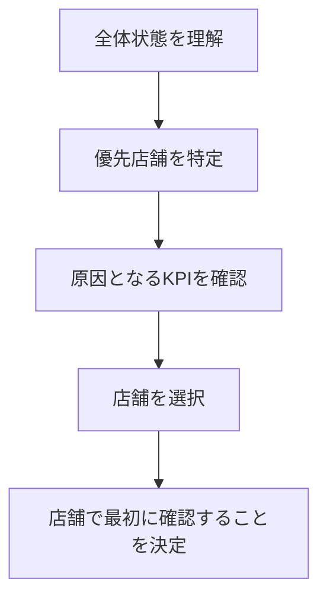

# V1情報アーキテクチャ

## 判断順序

## Dashboard階層

| 順序 | 領域 | 主な問い | 主情報 | 次の遷移 |
| --- | --- | --- | --- | --- |
| 1 | Executive Summary | 全体はどういう状態か | 結論文、総売上、利益状態、要対応数 | 優先アクション |
| 2 | 優先アクション | どこへ時間を使うか | 最大3件、改善テーマ、KPI、差分、次に確認 | 店舗詳細の該当区分 |
| 3 | 業績ドライバー | 何が原因か | 結果／顧客／価値／継続・運営 | KPI詳細／推移 |
| 4 | 店舗ポートフォリオ | どの状態群を見るか | 好調／安定／改善中／要対応の件数 | 一覧絞り込み |
| 5 | 店舗一覧 | どの店舗へ移るか | 比較列、主な改善テーマ | 店舗詳細 |

## 店舗詳細階層

1. 店舗名、状態、対象月、利益状態
2. 1〜2文の結論と「次に確認すること」
3. 主KPIの要約
4. サマリー／売上・利益／顧客・リピート／価値・生産性
5. 月別推移と内訳

店舗詳細はDashboardの縮小版ではなく、「この店舗で何が起き、なぜ起き、最初に何を確認するか」へ集中する。

## 情報の主従

- 最上位: 状態結論、改善テーマ、次に確認すること
- 主情報: 主KPIの現在値
- 比較情報: 予算比、前年同月比、年間累計
- 内訳: 新規／既存、技術／店販／MID／EC按分、リピート区分
- 補足: 対象期間、確定予定、最終更新、データ反映数

前年比と予算比は独立カードにせず、必ず対象KPIに従属させる。

## 状態モデル

店舗状態（好調、安定、改善中、要対応）とデータ状態（取得済み、集計中、準備中）、システム状態（読み込み中、通信エラー、権限なし、データなし）を別レイヤーとして扱う。見た目と文章も共有しない。

## 状態保持

一覧から詳細へ遷移する際に、対象月、月次／年間累計、全店／直営／FC、店舗状態、並び順、列表示、スクロール位置、遷移元を保持する。詳細の「一覧へ戻る」は履歴を復元し、初期値へ戻さない。
