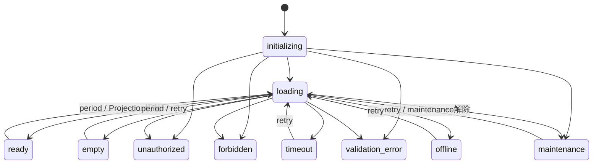

# Phase 5-4 Store Sales Runtime 設計

## Architecture

```text
Accounting Core
  -> Accounting KPI Engine
  -> Store Sales Projection API
  -> Store Sales Runtime
  -> Store Sales UI
```

UIの唯一のデータ入口は`runtime/index.js`である。UIはProjection adapter、Accounting API、KPI API、session helper、error codeを直接利用しない。

## Runtime責務

- Projection Adapterの生成・破棄・切替
- Runtime Stateのimmutable snapshotとsubscribe
- Feature Flag解決
- error codeから画面状態・安全な文言へのmapping
- initializing/loading/ready/empty/maintenance制御
- maintenance/timeout/offlineのretry
- canonical NOV HUB session復元・1回のrefresh・更新・破棄
- mock/preview/integration/staging/production Projection切替

## State

`initializing`、`loading`、`ready`、`empty`、`unauthorized`、`forbidden`、`validation_error`、`maintenance`、`timeout`、`offline`をRuntime契約とする。

UIはsnapshotの`status`、`projection`、`presentation`、`canRetry`だけを描画する。内部error、stack、raw responseは受け取らない。



## Feature Flag

- `mock`: test・開発用のlocalhost synthetic fixture
- `preview`: NOV HUB Preview用。localhost限定のmock adapterへ安全に変換
- `integration`: 隔離read-only Projection
- `staging`: staging endpointをintegration adapterへ接続
- `production`: 承認前のためadapter policyで起動拒否

Feature Flagはruntime configから解決し、URLや一般actor向けUIでは変更できない。`switchProjection`は将来のtrusted shell/operations用Runtime APIである。

## Reuse

将来のCorporate Management Runtimeでも、state registry、feature flag resolver、error presentation、session lifecycle、adapter factoryを共通化できる。業務固有部分はProjection contract、adapter factory、empty判定に限定する。

## Runtime Freeze

Phase 5-4完了時点でStore Sales Runtimeの責務を凍結する。次フェーズのProduction Readinessでは既存責務の設定・接続・運用検証のみを行い、責務追加は重大障害修正またはCTOの例外承認に限定する。
